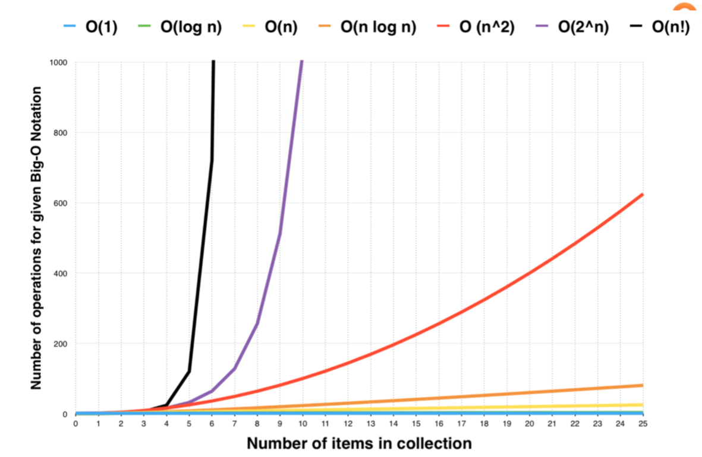

# 算法综述


## 1. 如何事半功倍地学习算法和数据结构

### 1.1 Chunk it up（切碎知识点）
庖丁解牛

脉络连接

### 1.2 Deliberate practing（刻意练习）
刻意练习

<font color=FF0099>**练习缺陷、不舒服、弱点地方**</font>

### 1.3 Feedback（获得反馈）
即时反馈

主动型反馈（自己去找）
- 高手代码（Github，LeetCode，etc.）

- 第一视角直播（一些直播的代码）

被动式反馈（高手给你指点）
- code review

- 教练看你打，给你反馈

### 1.4 算法切题四件套
Clarification（明确题目意思）

Possible solutions（<font color=FF0099>**把所有可能解法都搞出来，对比时间复杂度和空间复杂度，使用最优解**</font>）
- compare（time/space）

- optimal（加强）

Coding（多写）

Test cases

## 2. 算法复杂度分析
算法复杂度主要分为：时间复杂度和空间复杂度。

### 2.1 常见复杂度表示
O(1)：Constant Complexity: Constant 常数复杂度

O(log n)：Logarithmic Complexity: 对数复杂度

O(n)：Linear Complexity: 线性时间复杂度

O(n^2)：N square Complexity 平⽅

O(n^3)：N square Complexity ⽴⽅

O(2^n)：Exponential Growth 指数

O(n!)：Factorial 阶乘

### 2.2 示例
O(1)
```java
int n = 1000;
System.out.println("Hey - your input is: " + n);
```

O(1)
```java
int n = 1000;
System.out.println("Hey - your input is: " + n);
System.out.println("Hmm.. I'm doing more stuff with: " + n);
System.out.println("And more: " + n);
```

O(N)
```java
for (int = 1; i <= n; i++) {
    System.out.println("Hey - I'm busy looking at: " + i);
}
```

O(N^2)
```java
for (int i = 1; i <= n; i++) {
    for (int j = 1; j <= n; j++) {
        System.out.println("Hey - I'm busy looking at: " + i + " and " + j);
    }
}
```

O(log(n))
```java
for (int i = 1; i < n; i = i * 2) {
    System.out.println("Hey - I'm busy looking at: " + i);
}
```

O(k^n)
```java
for (int i = 1; i <= Math.pow(2, n); i++){
    System.out.println("Hey - I'm busy looking at: " + i);
}
```

O(n!)
```java
for (int i = 1; i <= factorial(n); i++){
    System.out.println("Hey - I'm busy looking at: " + i);
}
```

### 2.2 算法复杂度趋势图
 

## 3. 如何通过 LeetCode 来进行算法练习
国外：https://leetcode.com/problemset/all/

国内：https://leetcode-cn.com/problemset/all/
