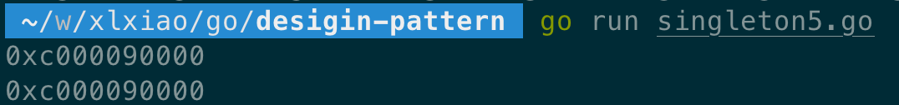

# 设计模式系列（一）：单例模式


本文主要介绍了什么是单例模式，同时给出了其应用场景及 Golang 代码的具体实现。

## 1. 什么是单例
单例模式是一种常用的软件设计模式，其定义是单例对象的类只能允许一个实例存在。

### 1.1 优点
在内存里只有一个实例，减少了内存的开销，尤其是频繁的创建和销毁实例。
避免对资源的多重占用（比如写文件操作）。

### 1.2 应用场景
外部资源：每台计算机有若干个打印机，但只能有一个PrinterSpooler，以避免两个打印作业同时输出到打印机。内部资源：大多数软件都有一个（或多个）属性文件存放系统配置，这样的系统应该有一个对象管理这些属性文件。

Windows 的Task Manager（任务管理器）就是很典型的单例模式（这个很熟悉吧），想想看，是不是呢，你能打开两个 windows task manager 吗？

windows 的 Recycle Bin（回收站）也是典型的单例应用。在整个系统运行过程中，回收站一直维护着仅有的一个实例。 

网站的计数器，一般也是采用单例模式实现，否则难以同步。

应用程序的日志应用，一般都何用单例模式实现，这一般是由于共享的日志文件一直处于打开状态，因为只能有一个实例去操作，否则内容不好追加。

Web 应用的配置对象的读取，一般也应用单例模式，这个是由于配置文件是共享的资源。

数据库连接池的设计一般也是采用单例模式，因为数据库连接是一种数据库资源。数据库软件系统中使用数据库连接池，主要是节省打开或者关闭数据库连接所引起的效率损耗，这种效率上的损耗还是非常昂贵的，因为何用单例模式来维护，就可以大大降低这种损耗。 

多线程的线程池的设计一般也是采用单例模式，这是由于线程池要方便对池中的线程进行控制。 

操作系统的文件系统，也是大的单例模式实现的具体例子，一个操作系统只能有一个文件系统。

## 2. 具体实现

### 2.1 懒汉式，非线程安全
```go
package main

import (
    "fmt"
)

type restClient struct {
    protocol string
    hostname string
}

var client *restClient

func GetClient() *restClient {
    if client == nil {
        client = &restClient{
            protocol: "http",
            hostname: "www.baidu.com",
        }
    }

    return client
}

func main() {
    a := GetClient()
    fmt.Printf("%p\n", a)

    b := GetClient()
    fmt.Printf("%p\n", b)
}
```

运行结果如下。可以看到 a 和 b 的地址是相同的。


但是这种方式存在一个缺点：非线程安全。两个线程同时来访问 instance == nil 逻辑，上面的结构体就会有多个对象了。

这边可以模拟下这种非线程安全的问题，代码如下：
```go
package main

import (
    "fmt"
    "time"
)

type restClient struct {
    protocol string
    hostname string
}

var client *restClient

func GetClient() *restClient {
    if client == nil {
        time.Sleep(1 * time.Second)
        client = &restClient{
            protocol: "http",
            hostname: "www.baidu.com",
        }
    }

    return client
}

func main() {
    go func() {
        a := GetClient()
        fmt.Printf("%p\n", a)
    }()

    go func() {
        b := GetClient()
        fmt.Printf("%p\n", b)
    }()

    time.Sleep(2 * time.Second)
}
```

运行结果如下：


### 2.2 饿汉式
```go
package main

import "fmt"

type restClient struct {
    protocal string
    hostname string
}

var client *restClient = &restClient{
    protocal: "http",
    hostname: "www.baidu.com",
}

func GetClient() *restClient {
    return client
}

func main() {
    a := GetClient()
    fmt.Printf("%p\n", a)

    b := GetClient()
    fmt.Printf("%p\n", b)
}
```

运行结果如下：


但饿汉式的单例实现也是有缺点的，<font color=FF0099>**如果单例创建初始化比较复杂耗时时，应用加载时间会延长**</font>。

### 2.3 懒汉加锁
```go
package main

import (
    "fmt"
    "sync"
    "time"
)

type restClient struct {
    protocal string
    hostname string
}

var client *restClient

var mu sync.Mutex

func GetClient() *restClient {
    mu.Lock()
    defer mu.Unlock()

    if client == nil {
        time.Sleep(1 * time.Second)

        client = &restClient{
            protocal: "http",
            hostname: "www.baidu.com",
        }
    }

    return client
}

func main() {
    go func() {
        a := GetClient()
        fmt.Printf("%p\n", a)
    }()

    go func() {
        b := GetClient()
        fmt.Printf("%p\n", b)
    }()

    time.Sleep(2 * time.Second)
}
```

运行结果如下：


这种方式的懒汉加锁，虽然可以解决懒汉式的线程不安全问题。<font color=FF0099>**是它每次获取实例都需要通过加锁的方式，这种损耗也是极大的。**</font>

### 2.4 懒汉加锁，双重检查，带检查锁
```go
package main

import (
    "fmt"
    "sync"
    "time"
)

type restClient struct {
    protocal string
    hostname string
}

var client *restClient

var mu sync.Mutex

func GetClient() *restClient {
    if client == nil {
        time.Sleep(1 * time.Second)

        fmt.Println("execute lock")

        mu.Lock()
        defer mu.Unlock()

        if client == nil {
            client = &restClient{
                protocal: "http",
                hostname: "www.baidu.com",
            }
        }
    }

    return client
}

func main() {
    go func() {
        a := GetClient()
        fmt.Printf("%p\n", a)
    }()

    go func() {
        b := GetClient()
        fmt.Printf("%p\n", b)
    }()

    time.Sleep(2 * time.Second)
}
```

执行结果如下：


这种方式的懒汉加锁，避免了每次获取实例时都去加锁。<font color=FF0099>**但是如果两个线程同时进入 client == nil 的逻辑，还是不可避免的重复调用锁，不过已经从一定程度上避免了锁的重复调用了**</font>。

### 2.5 懒汉加锁，sync.Once 实现
```go
package main

import (
    "fmt"
    "sync"
    "time"
)

type restClient struct {
    protocal string
    hostname string
}

var client *restClient

var once sync.Once

func GetClient() *restClient {
    once.Do(func() {
        time.Sleep(1 * time.Second)

        client = &restClient{}
    })

    return client
}

func main() {
    go func() {
        a := GetClient()
        fmt.Printf("%p\n", a)
    }()

    go func() {
        b := GetClient()
        fmt.Printf("%p\n", b)
    }()

    time.Sleep(2 * time.Second)
}
```

运行结果如下：


使用 sync.Once 实现单例更加简单。可以看到即使在 once.Do 使用了 time.Sleep 逻辑，最终 a 和 b 也是同一个示例。

而 sync.Once 内部本质上也是双重检查的方式，这种方式比自己写双重检查更简洁。Once 的源码如下：
```go
func (o *Once) Do(f func()) {　　　
    if atomic.LoadUint32(&o.done) == 1 {
        return
    }

    o.m.Lock()
    defer o.m.Unlock()

    if o.done == 0 {
        defer atomic.StoreUint32(&o.done, 1)
        f()
    }
}
```

## 3. 参考文献
[1] https://www.cnblogs.com/xuwendong/p/9633985.html.

[2] https://www.runoob.com/design-pattern/singleton-pattern.html.

[3] https://www.cnblogs.com/restartyang/articles/7770856.html.

[4] https://studygolang.com/articles/11444.

[5] https://studygolang.com/articles/11366.

[6] https://www.cnblogs.com/wpnine/p/10426105.html.
