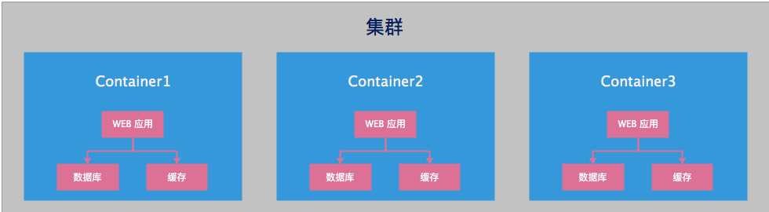
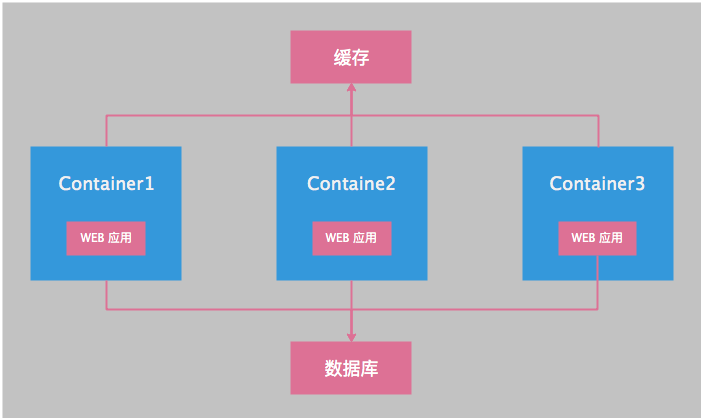

# Dockerfile 最佳实践（常规指南和建议）


本文主要介绍了编写 Dockerfile 时的一些最佳实践，主要包括一些常规指南和建议。

## 1. 忽略 docker build 构建文件
在 docker build 的过程中，首先会将指定的上下文目录打包传递给 <font color=FF0099>**docker 引擎**</font>，而这个上下文目录中可能并<font color=FF0099>**不是所有的文件**</font>我们都会在 Dockerfile 中使用到，那么这个时候就可以在 <font color=FF0099>**.dockerignore**</font> 文件中指定在传递给 <font color=FF0099>**docker 引擎**</font>时需要忽略掉的文件或文件夹。

.dockerignore 使用方法和 Git 的 .gitignore 使用方法相似。


## 2. 使用多阶段构建
<font color=FF0099>**Docker 17.05 以上的版本**</font>支持多阶段构建。

多阶段构建能够有效减少构建镜像的大小。

关于多阶段构建的优势可以参考：
<a href="https://www.lesliexlxiao.com/2019/03/28/docker/multi-stage-build/" target="_blank">
Docker 多阶段构建</a>。


## 3. 避免安装不必要的包
安装不必要的包会带来以下问题：

  - 增加了构建镜像的时间。

  - 构建出的镜像会变得比较臃肿。


## 4. 一个容器只运行一个进程
确保一个容器只运行一个进程。<font color=FF0099>**将多个应用解耦到不同的容器中，**</font>这样能够确保容器的横向扩展和复用。例如可以将一个 WEB 应用拆分为三个容器：WEB 应用
、数据库、缓存。

如果不拆分为三个容器，会带来什么问题。请看下图，横向扩展之后，数据库和缓存均被扩展为了多份，这是不合理的。

 

如果拆分为三个容器，那么扩展 WEB 应用，就会变得方便许多。如下图所示：

 

## 5. 镜像层数尽可能少
需要在 Dockerfile 可读性、长期可维护性和减少层数之间<font color=FF0099>**做一个平衡。**</font>

如果一味的为了可读性而不加控制的增加镜像层数，最后会导致镜像层级增多，<font color=FF0099>**镜像的构建速度会变得很慢。**</font>

如果一味的为了减少镜像层数，而将多个操作放置到镜像某一层去做，这样 <font color=FF0099>**Dockerfile 的可读性会变得很差**</font>，导致后期无法维护。


## 6. 将多行参数排序
<font color=FF0099>**多行参数按字母顺序排序，**</font>可以避免重复包含同一个包，更新包列表时也更容易。<font color=FF0099>**反斜杠符号 \ 之前添加一个空格，**</font>以增加可读性。示例如下：

```Dockerfile
RUN apt-get update && apt-get install -y \
  curl=7.47.0-1ubuntu2.11 \
  openssh-client=1:7.2p2-4ubuntu2.6 \
  openssh-server=1:7.2p2-4ubuntu2.6 \
  sudo=1.8.16-0ubuntu1.5 \
  telnet=0.17-40
```

## 7. 清除缓存的包
缓存的包往往会增加镜像的体积，这样就会<font color=FF0099>**导致镜像下载速度变慢**</font>。对于无用的缓存，应当及时清理。

```Dockerfile
RUN apt-get update && apt-get install -y \
  curl=7.47.0-1ubuntu2.11 \
  openssh-client=1:7.2p2-4ubuntu2.6 \
  openssh-server=1:7.2p2-4ubuntu2.6 \
  sudo=1.8.16-0ubuntu1.5 \
  telnet=0.17-40 && \
  apt-get clean
```

  - 如上，apt-get clean 用于清除已缓存的包文件。


```Dockerfile
RUN yum install -y net-tools-2.0 \
  vim-enhanced-7.4.160 && \
  yum clean all
```

  - 如上，yum clean all 用于清除 yum 缓存。

<font color=FF0099>**安装包时，带上版本号，确保重新构建镜像时，构建出的镜像是一致的。**</font>


## 8. 充分利用构建缓存
Docker 在执行每条 Dockerfile 指令之前，都会在缓存中查找是否已经存在可重复的镜像，如果有，将不再重复创建。

缓存的匹配规则：从基础镜像开始，下一条指令将和该基础镜像的所有子镜像进行匹配，检查这些子镜像被创建时使用的指令是否和被检查的指令完全一样。如果不是，则缓存失效。

示例如下：

第一步，初始 Dockerfile 文件如下：

```Dockerfile
FROM centos

RUN echo hello1
```

第二步，构建镜像：
```shell
$ docker build . -t centos-hello1

----------output----------
Step 1/2 : FROM centos
---> 9f38484d220f
Step 2/2 : RUN echo hello1
---> Running in 7285c267446d
hello1
Removing intermediate container 7285c267446d
---> d5e9279556bb
Successfully built d5e9279556bb
Successfully tagged centos-hello1:latest
```
- 这一步构建出了镜像 d5e9279556bb。

第三步，修改 Dockerfile 文件如下：
```Dockerfile
FROM centos

RUN echo hello1
RUN echo hello2
```

第四步，构建镜像：
```shell
$ docker build . -t centos-hello2

----------output----------
Step 1/3 : FROM centos
---> 9f38484d220f
Step 2/3 : RUN echo hello1
---> Using cache
---> d5e9279556bb
Step 3/3 : RUN echo hello2
---> Running in 10952b8314a7
hello2
Removing intermediate container 10952b8314a7
---> 129609739368
Successfully built 129609739368
Successfully tagged centos-hello2:latest
```
- 这一步构建镜像的时候<font color=FF0099>**使用了第二步构建的缓存镜像 d5e9279556bb（Using cache）**</font>，构建镜像速度较快。

第五步，不使用缓存构建：
```shell
$ docker build . -t cenots-hello2-noused-cache --no-cache=true

----------output----------
Sending build context to Docker daemon  3.072kB
Step 1/3 : FROM centos
---> 9f38484d220f
Step 2/3 : RUN echo hello1
---> Running in c6c5e8d663d4
hello1
Removing intermediate container c6c5e8d663d4
---> 45f6aa55ff9f
Step 3/3 : RUN echo hello2
---> Running in 83e31be999b8
hello2
Removing intermediate container 83e31be999b8
---> 86dd37807f27
Successfully built 86dd37807f27
Successfully tagged cenots-hello2-noused-cache:latest
```
- 这一步使用<font color=FF0099>**参数 --no-cache=true，构建镜像时不使用缓存，从而导致构建镜像的速度变慢。**</font>

第六步，修改 Dockerfile 文件如下：
```Dockerfile
FROM centos

RUN echo hello0
RUN echo hello1
RUN echo hello2
```

第七步，构建镜像：
```shell
$ docker build . -t centos-hello0-before-hello1

----------output----------
Sending build context to Docker daemon  3.072kB
Step 1/4 : FROM centos
---> 9f38484d220f
Step 2/4 : RUN echo hello0
---> Running in 584ea98c1a66
hello0
Removing intermediate container 584ea98c1a66
---> be2bf7b8e6c6
Step 3/4 : RUN echo hello1
---> Running in 26583e38906e
hello1
Removing intermediate container 26583e38906e
---> 57f389ce65dd
Step 4/4 : RUN echo hello2
---> Running in 7a76cd08163b
hello2
Removing intermediate container 7a76cd08163b
---> e9d340a31150
Successfully built e9d340a31150
Successfully tagged centos-hello0-before-hello1:latest
```
- 由于 Dockerfile 在 echo hello1 之前插入了 echo hello0，故在构建镜像时，<font color=FF0099>**发现 centos 的所有子镜像被创建时使用的指令没有和当前指令一样的，从而导致缓存失效。**</font>

第八步，修改 Dockerfile 文件如下：
```Dockerfile
FROM centos

RUN echo hello0
RUN echo hello11
RUN echo hello2
```

第九步，构建镜像：
```shell
$ docker build . -t centos-hello11

----------output----------
Step 1/4 : FROM centos
---> 9f38484d220f
Step 2/4 : RUN echo hello0
---> Using cache
---> be2bf7b8e6c6
Step 3/4 : RUN echo hello11
---> Running in b401f45f6b69
hello11
Removing intermediate container b401f45f6b69
---> 60c181ac30e1
Step 4/4 : RUN echo hello2
---> Running in 79539b71f803
hello2
Removing intermediate container 79539b71f803
---> eb22881533b5
Successfully built eb22881533b5
Successfully tagged centos-hello-test:latest
```

- 可以看到 Step 2/4：RUN echo hello0 仍然使用了镜像 be2bf7b8e6c6，这时因为在第七步中，生成了子镜像 be2bf7b8e6c6。<font color=FF0099>**其实每执行完一条 Dockerfile 指令，都会生成一个中间层镜像。**</font>

- 具体查看这种中间层镜像的方式如下：
```shell
$ docker images -a | grep be2bf7b8e6c6

----------output----------
<none>         <none>              be2bf7b8e6c6        14 minutes ago       202MB
```

在大多数情况下，只需要简单地对比 Dockerfile 中的指令和子镜像。然而，有些指令需要更多的检查和解释。

<font color=FF0099>**对于 ADD 和 COPY 指令，镜像中对应文件的内容也会被检查，每个文件都会计算出一个校验和**</font>。文件的最后修改时间和最后访问时间不会纳入校验。在缓存的查找过程中， 会将这些校验和和已存在镜像中的文件校验和进行对比。如果文件有任何改变，比如内容和元数据，则缓存失效。

除了 ADD 和 COPY 指令，缓存匹配过程不会查看临时容器中的文件来决定缓存是否匹配。例如，当执行完 RUN apt-get -y update 指令后，容器中一些文件被更新，但 Docker 不会检查这些文件。<font color=FF0099>**这种情况下，只有指令字符串本身被用来匹配缓存。**</font>

一旦缓存失效，所有后续的 Dockerfile 指令都将产生新的镜像，缓存不会被使用。

<font color=FF0099>**综上，我们应该将经常变动的镜像层级放到 Dockerfile 文件的后面，这样才不会导致构建镜像时缓存经常失效，从而提高镜像构建速度。**</font>

## 9. 参考文献
[1] yeasy.Docker 从入门到实践[M]:367-368.

[2] 廖煜,晏东.Docker 容器实战[M].北京:电子工业出版社,2016:181-183.
