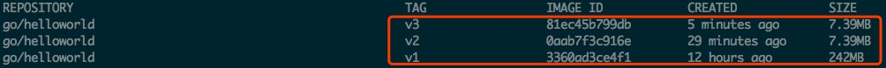

# Docker 多阶段构建


本文主要介绍了 Docker 的多阶段构建，以及多阶段构建的一些优势。

<font color=FF0099>**Docker 17.05 之前的版本是不支持 multi-stage 镜像构建**</font>，通常会采用两种方式构建。一种是全部放入一个 Dockerfile 文件中构建，一种是分散到多个 Dockerfile 文件中构建。

## 1. 单 Dockerfile 构建
这种方式会将项目及其依赖库的编译、测试、打包的所有构建过程放到一个 Dockerfile 中。示例如下：

app.go 文件
  ```go
  package main

  import "fmt"

  func main() {
      fmt.Printf("Hello World!\n");
  }
  ```

Dockerfile.one 文件

  ```file
  FROM golang:1.9-alpine

  WORKDIR /var/www/code/go/

  COPY app.go .

  RUN go build app.go

  CMD ["./app"]
  ```

构建镜像

  ```shell
  $ docker build -t go/helloworld:v1 -f Dockerfile.one .

  ----------output----------
  Sending build context to Docker daemon  3.072kB
  Step 1/5 : FROM golang:1.9-alpine
   ---> b0260be938c6
  Step 2/5 : WORKDIR /var/www/code/go/
  Removing intermediate container e5fdc95ae667
   ---> bf72ca2f4c1e
  Step 3/5 : COPY app.go .
   ---> 4303ab391236
  Step 4/5 : RUN go build app.go
   ---> Running in 61ff23d31be3
  Removing intermediate container 61ff23d31be3
   ---> 00924c2d8fea
  Step 5/5 : CMD ["./app"]
   ---> Running in bc84752fea13
  Removing intermediate container bc84752fea13
   ---> 3360ad3ce4f1
  Successfully built 3360ad3ce4f1
  Successfully tagged go/helloworld:v1
  ```

这种构建方式存在的问题：

- Dockerfile 过长（<font color=FF0099>**包括一系列编译、测试、打包过程**</font>），可维护性降低。

- 镜像层次多，增加构建时长。因为打镜像时<font color=FF0099>**每一层都会起容器**</font>执行一些命令，如果<font color=FF0099>**层级过多镜像会非常臃肿且构建时间变长**</font>[<sup>2</sup>](#refer-anchor-1)。

  - 如上例中的 <font color=FF0099>**COPY 源码，构建源码**</font>都会增加镜像的层级。

- 镜像体积较大，部署时间变长。

  - 镜像体积大，可以看到该 Dockerfile 构建出的镜像有 242M。

 

  - <font color=FF0099>**源代码存在泄漏风险**</font>。

    - 这是由于构建出的镜像里面包含了源代码，可以通过如下命令查看：

        ```shell
        $ docker run --rm go/helloworld:v1 ls

        ----------output----------
        app.go
        app
        ```
        * <font color=FF0099>**可以看到包含了源代码 app.go 文件**</font>。


## 2. 多 Dockerfile 构建
这种方式主要是把镜像过程分散到多个 Dockerfile 中。主要实现方法是<font color=FF0099>**事先在一个 Dockerfile 将项目及其依赖库编译测试打包好，再将包拷贝到运行环境中。**</font>这种方式需要两个 Dockerfile 和一段编译脚本才可实现。示例如下：

Dockerfile.build 文件

```
FROM golang:1.9-alpine

WORKDIR /var/www/code/go/

COPY app.go .

RUN go build app.go
```

Dockerfile.run 文件
```
FROM alpine:latest

WORKDIR /var/www/code/go/

COPY app .

CMD ["./app"]
```

build.sh 文件
```shell
#!/bin/sh

echo Building go/helloworld:build

docker build -t go/helloworld:build -f Dockerfile.build .

# create temporary container
docker create --name extract go/helloworld:build
# extract app
docker cp extract:/var/www/code/go/app ./app
# remove temporary container
docker rm -f extract

echo Building go/helloworld:v2

docker build --no-cache -t go/helloworld:v2 . -f Dockerfile.run

rm ./app
```

运行脚本

```shell
$ chmod +x build.sh

$ ./build.sh
```

如果分散多个 Dockerfile 会存在如下问题：
  - 部署过程复杂，一旦涉及到的 Dockerfile 过多，整合比较容易出错。

当然这种方式也有自己的优势：

  - 将这种方式和第一种方式生成的镜像做下比较，如下图所示镜像 v2 的要比镜像 v1 小很多。

 

  - 这是因为镜像 v1 需要的基础镜像 golang:1.9-alpine 比镜像 v2 需要的基础镜像 alpine:latest 要大的多。

 

## 3. multi-stage 镜像构建
<font color=FF0099>**Dockerfile v17.05 开始支持多阶段构建( multi-stage builds )**</font>，只需要一个 Dockerfile。示例如下：

Dockerfile.three
```
FROM golang:1.9-alpine as builder

WORKDIR /var/www/code/go/

COPY app.go .

RUN go build app.go

FROM alpine:latest as prod

WORKDIR /var/www/code/go/

COPY --from=0 /var/www/code/go/ .

CMD ["./app"]
```

构建镜像

```shell
$ docker build -t go/helloworld:v3 .

----------output----------
Sending build context to Docker daemon  7.168kB
Step 1/8 : FROM golang:1.9-alpine as builder
 ---> b0260be938c6
Step 2/8 : WORKDIR /var/www/code/go/
 ---> Using cache
 ---> bf72ca2f4c1e
Step 3/8 : COPY app.go .
 ---> Using cache
 ---> 4303ab391236
Step 4/8 : RUN go build app.go
 ---> Using cache
 ---> 00924c2d8fea
Step 5/8 : FROM alpine:latest as prod
 ---> 5cb3aa00f899
Step 6/8 : WORKDIR /var/www/code/go/
 ---> Using cache
 ---> 328cf5fcaaf2
Step 7/8 : COPY --from=0 /var/www/code/go/ .
 ---> eab42f02e484
Step 8/8 : CMD ["./app"]
 ---> Running in f8a42b2f9a14
Removing intermediate container f8a42b2f9a14
 ---> 81ec45b799db
Successfully built 81ec45b799db
Successfully tagged go/helloworld:v3
```

这种构建方式的优势：

- 解决了上述第一种方式和第二种方式存在的弊端。

- 镜像体积大小对比如下:

 

## 4. 只构建某一阶段的镜像
使用 as 来为某一阶段命名
```
FROM golang:1.9-alpine as builder
```

以上述例子为例，只想构建 builder 阶段的镜像时，可以在 docker build 命令时加上 --target 参数
```shell
 $ docker build --target builder -t username/imagename:tag .
```

## 5. 构建时从其他镜像复制文件
从上一阶段镜像中复制文件
```
COPY --from=0 /go/src/github.com/go/helloworld/app .
```

  - 指定 --from=0 参数，把前一阶段构建的产物拷贝到了当前的镜像中。

```
COPY --from=builder /go/src/github.com/go/helloworld/app .
```

  - 指定 --from=builder 参数，把命名阶段的构建产物拷贝到当前的镜像中。


复制任意镜像中的文件
```
COPY --from=nginx:latest /etc/nginx/nginx.conf /nginx.conf
```

## 6. 参考文献
[1] yeasy.Docker 从入门到实践[M]:98-104.

<div id="refer-anchor-1"></div>
[2] 使用 Dockerfile 定制镜像[N].https://www.dazhuanlan.com/2020/02/22/5e51368ed08e7/.

[3] 孙宏亮.深刻理解 Docker 镜像大小[N].https://blog.csdn.net/shlazww/article/details/47375009.
