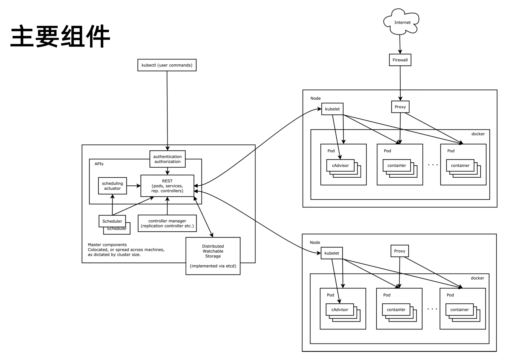

# [笔记]Kubernetes 架构原则和对象设计


本文主要是看了极客时间上《Kubernetes 架构原则和对象设计》的分享而做的一些笔记及总结。

<!--more-->

## 1. Kubernetes 源码如何走读
cmd 里面的代码调用 pkg 代码，cmd 里面执行 go build 会生成各个组件的二进制文件，它是编译的入口。所以读代码<font color=FF0099>**大部分读 pkg 里面的代码**</font>。

下图主要 Kubernetes 代码分布结构：


OpenAPI 是 api 定义的标准规范。Kubernetes 主要遵循 [Schema Object](https://github.com/OAI/OpenAPI-Specification/blob/main/versions/3.1.0.md#schemaObject) 规范定义对象。

## 2. 命令式和声明式
命令式：
- 此方法明确写出系统应该执行某指令，并且期待系统返回期望结果。
- 我要你做什么，怎么做，请严格按照我说的做。
- 比如遥控器你输入频道 1，电视机跳转到频道 1。

声明式：
- 声明式系统指程序代码描述系统应该做什么而不是怎么做。仅限于描述要达到什么目的，如何达到目的交给系统。
- 我需要你帮我做点事，但是我只告诉你我需要你做什么，不是你应该怎么做。
- 比如调节空调温度，你输入期望的温度，但是温度不会立刻到达相应的温度。

Kubernetes 就是声明式的系统，它具有幂等性。每次我要你做事，请给我返回相同结果。

## 3. Kubernetes：声明式系统
核心对象如下：
- Node：计算节点的抽象，用来描述计算节点的资源抽象、健康状态等。
- Namespace：资源隔离的基本单位，可以简单理解为文件系统中的目录结构。
  - Kubernetes 有 Namespace 和 Non-Namesapce 对象。<font color=FF0099>**Node 就属于 Non-Namesapce 对象，它属于整个集群**</font>。
- Pod：用来描述应用实例，包括镜像地址、资源需求等。Kubernetes 中最核心的对象，也是打通应用和基础架构的秘密武器。
- Service：服务如何将应用发布成服务，本质上是负载均衡和域名服务的声明。

## 4. Kubernetes 架构
基本架构图：


Node 节点：
- kubelet 组件：每个节点上跑一个 kubelet，负责把节点状态的上报给 api server。
  - 负责调度到对应节点的 Pod 的生命周期管理，执行任务并将 Pod 状态上报给主节点。通过容器运行时（拉取镜像、启动和停止容器等）来运行这些容器，还会定期执行被请求的容器的健康探测程序。
- kube-proxy 组件：负责节点的网络，在主机上维护网络规则并执行连接转发。还负责对正在服务的 Pod 进行负载平衡。
  - service 的负载均衡都是有由 proxy 来配置的。

Master 节点：
- api server 组件：这是 Kubernetes 控制面板中唯一带有用户可访问 API 以及用户可交互的组件。API 服务器会暴露一个 RESTful 的 Kubernetes API 并使用 JSON 格式的清单文件(manifest files)。
  - api server 部署在 k8s master 上，属于管理节点上的一个组件，也是整个集群的 api 网关，组件和组件之间不通信，所有的组件都是通过 api server 通信。
- etcd 组件：Kubernetes 使用 "etcd"。这是一个强大的、稳定的、高可用的键值存储，被 Kubernetes 用于长久储存所有的 API 对象。
- scheduler 组件：调度器会监控新建的 pods（一组或一个容器）并将其分配给节点。
  - 用户建一个 pod，scheduler 调度到对应的节点。kubelet 会把每个节点的可用状况，资源状态上报给 api server，存储到 etcd 里面去。当用户建 pod 时，请求会被发到 api server，scheduler 会找当前工作节点最适合当前的作业，它就把 pod 的 node name 更新掉，写回 api server，api server 保存到 etcd。api server 保存这个数据之后，某个工作节点的 kubelet 发现保存到它这边了，这个时候回去启动相应的 pod。kubelet 去读取当前镜像是什么，需要的资源是什么，然后调用容器接口，运行时会去下载容器镜像，启动容器实例，起的时候放到对应的 namespace 里面，通过 cgroup 控制资源，帮它挂载网路。
- controller 组件：被称为“kube-controller manager”，它运行着所有处理集群日常任务的控制器。包括了节点控制器、副本控制器、端点(endpoint)控制器以及服务账户等。
  - controller 会一直监控当前集群状态，监控它感兴趣的对象，如果对象发生变化，controller 就会做出相应的操作。比如某个节点或者应用发生了状态变化，那么需要自动化程序去做些事情。比如某个节点跑了一个 pod，这个时候节点磁盘坏了，或者系统死机等等，这个时候该节点上的应用就没法提供服务了。controller 里面有很多控制器，不同的控制器，node controller 发现某个节点坏了，这里面运行的所有 pod 都不能正常提供服务，它就应该把这里面的 pod 杀掉。如果是通过 deployment 创建的节点，其他控制器就会创建新的 pod，并且调度到其他节点上。控制器会一直监控当前集群状态，监控它感兴趣的对象，如果对象发生变化，控制器就会做出相应的操作。

扩展架构图：


## 5. etcd
etcd 是 CoreOS 基于 Raft 开发的分布式 key-value 存储，可用于服务发现、共享配置以及一致性保障(如数据库选主、分布式锁等)。
- 基本的 key-value 存储
- 监听机制（客户端访问 etcd 数据时，不是通过 get 方式，而是通过 watch 方式。客户端通过长连接监听方式，减少数据库的压力）
- key 的过期及续约机制，用于监控和服务发现
- 原子 CAS 和 CAD，用于分布式锁和 leader 选举


如何查看 etcd 数据？

- 查看以 / 开头的 key:
	```shell
	etcdctl --endpoints https://localhost:2379 --cert /etc/kubernetes/pki/etcd/server.crt --key /etc/kubernetes/pki/etcd/server.key --cacert /etc/kubernetes/pki/etcd/ca.crt get --keys-only --prefix /
	```

- 监听 default namespace 下 pod centos-5fddd22dd-nftnk 的变化：
	```shell
	etcdctl --endpoints https://localhost:2379 --cert /etc/kubernetes/pki/etcd/server.crt --key /etc/kubernetes/pki/etcd/server.key --cacert /etc/kubernetes/pki/etcd/ca.crt watch --prefix /registry/pods/default/centos-5fddd22dd-nftnk
	```
 
api server 是唯一一个和 etcd 通信的组件，它启动的时候会构建一个 watch cache，对 etcd 里面所有的数据做监听，然后把 etcd 数据放到 api server 进行缓存。api server 也提供了 watch 机制，所有的 kubernetes 组件，连接到 api server，先通过 list 把当前状态查询出来，通过 watch 的机制和 api server 保持长链接，如果 api server 里面的内容发生变更，会通过 event 的机制通知到每个组件，每个组件再执行自己的业务逻辑。

## 6. APIServer
Kube-APIServer 是 Kubernetes 最重要的核心组件之一，主要提供以下功能:
- 提供集群管理的 REST API 接口，包括：
  - 认证 Authentication
  - 授权 Authorization
  - 准入 Admission（Mutating & Valiating）
- 提供其他模块之间的数据交互和通信的枢纽（其他模块通过 APIServer 查询或修改数据，只有 APIServer 才直接操作 etcd）。
- APIServer 提供 etcd 数据缓存以减少集群对 etcd 的访问。


## 7. Controller Manager
主要功能：
- Controller Manager 是集群的大脑，是确保整个集群动起来的关键。
- 作用是确保 Kubernetes 遵循声明式系统规范，确保系统的真实状态(Actual
State)与用户定义的期望状态（Desired State）一致。
- Controller Manager 是多个控制器的组合，每个 Controller 事实上都是一个 control loop，负责侦听其管控的对象，当对象发生变更时完成配置。
- Controller 配置失败通常会触发自动重试，整个集群会在控制器不断重试的机 制下确保最终一致性( Eventual Consistency)。

控制器里面的逻辑基本都是一样的，一边监听 api server 的变化，api server 那边发生变化，会通知控制器。控制器里面的生产者会把这些变化放到一个队列里面，控制器的消费者再从队列里面取数据，取出来之后再做相应的逻辑处理。

任何的控制器都是生产者消费者模型。

<font color=FF0099>**写 contorller 时，如果消费失败了，应该把他们重新塞回队列里面，留给后面继续重试**</font>。出错重试的时候要有按指数级 rate limit，防止把 api server 打挂掉。

控制器的工作流程：

- 上面是一个生产者消费者模型。这里面部分代码可以由 kubernetes 代码框架，比如 kubebuilder 生成。主要生成 informer（event 观察的代码框架）和 lister（获取全量数据的代码框架）两部分内容。

- informer 和 lister 会去观察和监听的某一个对象，监听的对象会有 event，比如 Add Event、Delete Event 等。不同的 event 可以注册不同的 handler。发生这些 Event，会先塞入队列，把这些对象的 key 取出来，把这些 key（就是 namepsace 和 name）放到 Ratelimit Q 里面。另外一边会启动 goroutine，可以配置一个或多个 worker，从队列里面取数据，完成这些对象变化的处理，直到队列空位置。如果出错，重新塞回队列里面。

Informer 的内部机制：

- 这个要对应 kubernetes 代码去读。其目的就是构建一个快速处理对象变化的框架。

- 代码参考链接：[informer-framework](https://cncamp.notion.site/informer-framework-31ba746049ec472fb405e61482ed762f)。

控制器的协同工作原理：


## 8. 参考文献
[1] https://u.geekbang.org/lesson/167?article=426905.
