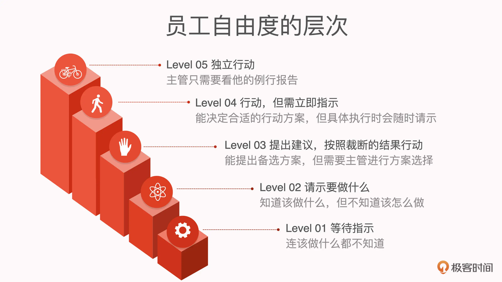

# [笔记]技术管理案例课：一线经理之开始带员工了

本文主要是对极客时间《技术管理案例课》一线经理之开始带员工了做的笔记，详细内容可参考：[一线经理之开始带员工了](https://time.geekbang.org/column/article/276140)。

## 06 员工沟通：怎么赢得之前平级的技术骨干的尊重？
### 经理的目标
**经理的目标是让团队的成员更强，凝聚力更高，从而可以一起去攻克更艰难的目标，而不是证明你比你的部下或者平级更强。**如果你沉浸在“让自己最强”的表象中，就会导致一个问题——你的水平会成为整个团队的瓶颈。

### 如何赢得尊重？
给干将搭台子
- **第一，给充分的资源支持**。对外，持续把员工推出去，让他们去负责解决这个强需求点。对内，努力去跟相关的高级总监、副总去谈，去找需求、要资源、要认可，让他们获得真正的成长。
- **第二，让员工有被需要的感觉，让他感觉自己在这个团队里“独一无二”**。你可以这么说，“**这件事很有意义，但是也很难**，就我们组织目前的人员配置，只有你最有可能搞定这件事，我没有别的选择，只能靠你。”但是不可马上希望看到回报。

克服心理屏障
- 你给员工提意见和建议的时候不要空谈，要不绕弯子地谈具体的细节。了解得越详细，你提意见的时候也就越有底气。
- **必须克服心理障碍直指他们的问题**，我前面说了，目的不是压得住压不住，而是为了这个团队更好，为了这个员工好。

提升自己的能力
- 如果你团队里有能力强的员工，这是对你自己提高自己能力的一个鞭策，你可以把团队中能力强的员工当成使自己更快提高的磨刀石！
- 那怎么提升自己的能力呢？最有效的方法就是去经历挫折，主动去走出舒适区。

## 09 | 人才培养：御人也是育人，人才培养的5个维度
怎么做好人才培养这件事？

### 积极主动，态度先行
考虑问题的时候应该从领导的角度、从组织的角度来看，而不是单单从自己的角度来看。

优秀的员工不是坐等领导安排工作，而是会主动去发现问题，去理清问题，他会跟领导说这个问题我考虑过很多种解决方案，优劣的分析结果在这里，我觉得应该选方案 X，原因是 ABC。

怎样激发大家的积极主动性？
- **第一步，明确标准，告知期待**。包括内容和程度两个维度的期待。
- **第二步，赏罚分明，落地要求**。
- **第三步，循序渐进，带头提升**。经理作为团队的带头人，自己做事儿就要注意积极主动性。经理也要主动约自己的上级做工作汇报。

### 实战积累为主
之前的学习方法一直就是先彻底搞清楚理论，再动手。我发现当时花了很多时间，但只是纸上谈兵，没产生什么实际效果。

必须先动手，一边干一边学。学 React ，自己去拿一个项目练练手，先学会怎么用再去查资料搞清楚原理。

注意点：**控制压力**。第一：配合定期谈心。第二：师傅带新人。

### 提高软实力
经理和技术骨干要跟员工做真实工作的情境模拟。

要给一些鼓励。比如经理可以鼓励员工对领导直抒己见。

### 给员工提供专注的机会
一个人什么事儿都做但方向上总是换来换去，和他在某一方向上专注发展三年不换方向，明显是后一个情况他更有可能成为所选方向上的专家。

自身后期也必须在某个方向上深耕，至少保持三年以上，这样才能成为某个领域的专家。

### 把握“挫折”的度
经历挫折是促使自己成长最快最有效的方式。

做经理的可以接受一两件事情没有做成，但是不希望员工的自信给打击没了。

到底怎么掌握度呢？
- 逐步提高难度。
- 压一压被培养人的耐受性，评估他的心理承受力在哪个点上。

无论用哪一种方式，都要保持跟被培养人的频繁沟通。

做经理的不愿意授权，担心这个做不好，那个不完美，员工就永远也成长不起来。
