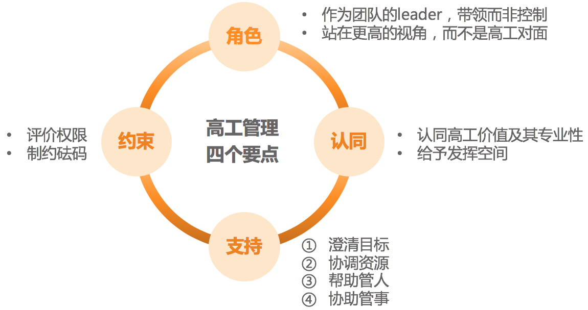

# [笔记]技术管理实战 36 讲：管理沟通篇

本文主要是对极客时间《技术管理实战 36 讲》管理沟通篇做的笔记，详细内容可参考：[任务执行篇](https://time.geekbang.org/column/article/41968)。

## 管理沟通那些事儿
四项工作有什么特点：

1. **技术开发工作**：使用电脑、学习语言、设计算法、开发功能、遵循规范……

2. **项目管理工作**：明确需求、制定计划、把控流程、推动执行、通报进展……

3. **和下级合作**：分配任务、跟进进展、辅导帮助、激发动力、评价结果……

4. **和上级合作**：领取任务、领会意图、提供建议、申请资源、寻求指导……

**第一，技术开发工作，主要和客观事物、自然规律打交道。**

**第二，项目管理工作。核心都是做事，都是基于规则和规范的。**

**第三，和下级合作。和下级的合作和沟通就变成了完全和人打交道了，可以利用你的职位和角色带来的职权。**

**第四，和上级合作。不确定性高。**自己很多任务是上级来安排的，这就很被动；上级比自己视野开阔，很多时候揣摩不透上级的意图，但是还不能不关心；自己需要的很多资源和支持都要向上级申请，但不见得能申请到；只能给上级提供建议，但是对方还常常不会采纳。

管理沟通让我们技术管理者们痛苦的主因是**确定性和规则性的减弱，不确定性的大幅度上升**。

通过如下框架探讨管理沟通。

在沟通这个不稳定的事物中，有哪些因素是稳定的：

1. 管理逻辑。随着管理认知和管理经验的不断积累而不断提升的，你的管理逻辑和管理判断力会越来越可靠，应对管理沟通也就越来越有掌控感。

2. 沟通通道。取决于你和对方的信任水平和默契程度。

3. 工具流程。

4. 影响力。

## 沟通经常鸡同鸭讲，说不到一块怎么办？
在沟通中，我们可以使用下图来对齐彼此的信息、感受和意图。

## 如何掌控自己的情绪，以及如何管理情绪化的员工？
为方便你管理自己的情绪，抑或者是帮你的下级和伙伴去提升情绪掌控能力，我梳理了整个步骤并总结为如下：
1. 认知它
2. 认同它
3. 觉察它

## 向下沟通的常见实例解析
**第一类问题，关于“如何批评员工”。**不可违背如下三个批评的原则：
1. 人是 OK 的原则。即，对事不对人。批评事，不要打击人，更不能给人贴标签。

2. 具体性原则。指出具体哪里做的不好，让对方容易认同。面向未来的原则。

3. 体现负面的暂时性和过去时，并提供改变的“出口”。

具体应该怎么批评呢？在教练领域有一个 AID 批评法：

当你遇到一些不符合期待的问题时，建议先从“我不要……”这种意图中走出来，问问自己“我要什么”。

**第二类问题，关于和下级员工沟通不顺畅。**
1. 对于内向沉默的员工，可以使用下图的“积极引导四步法”。

2. 对于总聊不到一个频道上的员工，可以使用我们在第 29 篇文章中介绍的“沟通层次图”。

3. 对于捉摸不透的员工，也可以使用“沟通层次图”或“3F 倾听”来分辨对方表达的内容。

4. 对于如何给员工的表现进行反馈，我推荐使用“主动积极式反馈”。

**第三类问题，关于如何应对“牛人”下属。**
关于如何和“牛人”技术高工相处，我的心得如下：

**第四类问题，关于如何应对一些“刺头”员工。**
那些需要你付出非常多的时间和精力去管理的员工，叫做“刺头”，也就是管理成本很高的员工。

具体参考下面的“刺头”员工价值评估四象限：

关于如何促使一个人做出改变，美国学者理查德·贝克哈德的改变公式，可以给我们一些指导：

