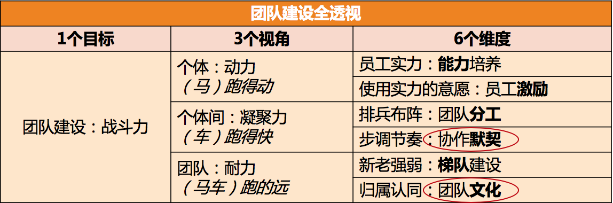

# [笔记]技术管理实战 36 讲：团队建设篇（管理三部曲之二）

本文主要是对极客时间《技术管理实战 36 讲》团队建设篇做的笔记，详细内容可参考：[团队建设篇](https://time.geekbang.org/column/article/40043)。

## 团队建设该从哪里入手？
团队建设时 6 个维度的工作要素：
- 针对员工个体的两个要素是：**能力和激励**；

- 针对员工个体之间的两个要素是：**分工和协作**；

- 针对团队整体的两个要素是：**梯队和文化**。

## 如何提升员工的个人能力？
能力划分方法一：知识、技能和才干。

能力划分方法二：人格力量、专业能力和通用能力。

- 人格力量：指一个人在面对某一情形时稳定的态度和表现，比如迎难而上、坚持不懈、积极正向、主动担当等等。
- 专业能力：一般就是指技术能力。
- 通用能力：沟通表达能力、团队协作能力、快速学习能力等等。

对于一个人的评价标准：
- 及格：能够胜任工作的要求。**如果连这个都不能达到，需要尽早淘汰**。
- 优秀：除了胜任工作要求，还需要脱颖而出，超出团队普通表现，成为整个团队的核心人物。

如何帮助员工提升个人能力，7-2-1 法则，70% 工作实践，20% 靠相互交流和讨论，10% 靠听课和看书自学。

第一类，关于帮助员工自学：
- 组织员工参加培训
- 为员工推荐和购买书籍
- 提供学习文档、视频等

第二类，关于相互交流讨论：
- 组织兴趣小组、读书会等
- 技术分享交流会、代码评审会等
- 重点工作复盘，即 case study 等

第三类，关于工作实践：
- 授权和辅导。给员工独立负责重要工作的机会，并给予辅导和反馈。
- 调研工作项目化。即把调研学习的工作进行项目化管理。
- 总结并内化。对于员工完成的重要工作，有必要请他们做一个工作总结，看看从中学到了什么。员工在这个总结和反思过程中的收获，甚至比总结的结果本身更重要。

如何激发员工学习的动力和意愿呢？三板斧：推、拉、放手。
推：给压力，推着他们学。
- **提出明确的工作要求**。比如，在 1 周内熟悉某个业务并可以做开发。
- **设置学习机制**。也就是强制要求遵守学习规则，并完成学习任务。 
- **peer pressure**。团队整体学习成长的氛围，会给不学习的员工带来压力。
- **惩罚**。包括从绩效等级、晋升机会、调薪幅度等等，对于学习意愿低的员工有适当的“关照”。

拉：就是给方向，引导他们学。
- **树立榜样**。把特别有学习意愿和成长快速的员工设为标杆人物，在团队内给予认可和奖励。
- **配备导师**。有明确导师的新人和员工，更愿意请教问题并快速融入团队。新人导师最好是团队内的，而资深员工的导师，可以找团队外更资深的人。
- **给地图**。成熟的公司往往会有技术方面的“技能图”，作为管理者，你也可以为自己团队制定一个成长的“技能图”，并标记出重要等级。这样，团队成员就有了学习和成长的方向，知道该往哪里使劲了。

放手：就是给发挥空间，让他们自主学习。
- 给员工勇挑重担的机会。在风险可控的情况下，**给员工承担责任的机会**，让他们去负责一些有挑战的工作。
- 给员工自主空间，让他们独立思考，独立决策。**你的辅导仅限于在他们的决策之后给出看法和建议**。
- 给员工信心和耐心，允许他们犯错、走弯路。因为很多经验都是踩坑儿踩出来的，所以**不能一出问题就劈头盖脸一顿批**，甚至是剥夺其做事的机会。

关于提升员工的能力，有两个信念特别重要。
- **第一是相信员工能力的差异性**。员工的创造力能为团队带来更大的价值。创造力往往来源于差异的碰撞，所以作为管理者，你要特别关注能力的丰富性，标准不能太单一。
- **第二是相信团队能力的系统性**。**所谓完美的团队，就是价值观相同，优势互补的团队**。所以，作为管理者，你要看到团队能力的系统性，不要把各个员工的能力割裂来看。

## 如何提升员工的工作意愿和积极性？
归结起来，不外乎是如下三个问题：

第一，**激励认知不系统**。不清楚激励都有哪些手段，以及如何使用，各种零散的说法让人无所适从。

第二，**激励可用资源匮乏**。实实在在的物质激励不受自己掌控，画大饼的精神激励，员工又不买账。

第三，**激励达不到效果**。虽然激励的动作都做到位了，但是并没有收到激发员工动力的效果，或者效果不够令人满意。

### 激励的系统认知
驱动力 2.0。采取的方案是“奖励好的行为、惩罚坏的行为”，也就是人们经常念叨的“胡萝卜加大棒”。效果还不错，但就是越用效果越差。**因为无论是奖励还是惩罚，这类驱动力最大的特点是来自外部刺激。**对于这类方法的改进：
- **具体**。就是表扬的内容和原因要非常具体，让员工和团队都知道他是因为哪一两点得到了认可。比如“员工 A 非常主动及时地处理了一个线上故障”“员工 B 在带新员工方面成绩突出”等。这样做，大家就能够清晰地接收到你在倡导什么，而且还能有效防止对没有受到表扬的人造成负激励。
- **公开**。公开表扬有两大好处，一个是被表扬的同学受到了更大的激励；另外一个更大的好处是，你其实告诉了团队每个人，什么样的行为和价值观在你们团队是被认同和倡导的。
- **及时**。所有的期待都有时效性，表扬及时，其实就是对员工的反馈要及时。一个不及时的表扬不但会让激励效果大打折扣。

驱动力 3.0。驱动力 3.0 的核心就在于自驱力。怎么激发员工的自驱力呢？
**第一，提升员工工作的自主性**。即，给员工一定程度的自主掌控感。
- **工作时间和地点上的自由度**。把焦点放在对结果的评价上，而不是把焦点放在员工的作息习惯上。
- **工作内容上的自由度**。员工可以在一定程度上选择自己的工作内容。Google 原来有个“20% 自由时间”的策略，即员工有 20% 的工作时间可自由支配，很受工程师们的热捧。
- **工作方法上的自由度**。

**第二，提升员工专精度，让员工持续有成长**。这里专精度是指为员工创造愿意自主投入的条件，因为只有自主投入才能带来专精。
- **明确的工作目标**。即，对员工的要求越清晰，他就越愿意投入努力。
- **目标要略有挑战**。即，对员工的要求要有一定挑战，但又不能太高。要求太高带给员工的是焦虑；要求太低带给员工的是无聊。
- **要能发挥其优势**。每个人都愿意做自己擅长的事情，如果某项工作能发挥员工的独特优势，必定会给他带来投入的热情。

**第三，给予员工意义和使命**。驱动力 3.0 在不拒绝利益的同时，更强调的是工作价值的最大化，希望自己做出来的工作是有意义和价值的。

管理者的一项重要修炼，就是去梳理团队的使命和项目的意义。

记得文中那个测试经理的案例吗？当他明白了自己团队**不仅仅是做测试的，更是整个公司产品和服务质量的保障者**之后，激发了他持续的工作热情，这就是意义的价值。

虽然驱动力 2.0 的激励效果在不断打折扣，但是基本的奖惩还是要做到位，这是基线。

### 激励可用资源匮乏
如果你把“驱动力 3.0”和“PERMA 模型”两个激励框架结合起来使用，你会发现，现在你可用的激励手段已经非常丰富了。

### 激励达不到效果
每一个激励方案都需要去思考和设计，把外驱和内驱结合起来，把长期和短期结合起来，把业务推进和职业幸福集合起来，把个人工作和团队使命结合起来。

## 如何兼顾团队分工的稳定性和灵活性？
为什么要分工？

**第一，为了实现规模化**。分工不是为了高效，而是为了能容纳更多的人来一起干更大、更复杂的事情，做简单的小事情，是不需要分工的。

**第二，为了实现协作**。我认为是先有协作的需求，才有分工。换句话说，分工是手段，协作是目的，分工和协作是不能割裂开的。所以，如果你有一个分工方案对协作不利，就本末倒置了。

**第三，为了实现专精**。精细化分工只需要每个员工关心单一工作内容，所以管理者更容易从整体上用人之长、避人之短，让专业的人更专业。

分工引发很多延伸效果：力资源配置优化、人才获取成本降低、员工工作积极性提升、执行效率变高等。

常见的分工形式：一类是矩阵式的，一类是 BU（BUSINESS UNIT）式的。

**矩阵式结构**。员工按照角色被划分到不同的团队，每个团队都有自己的负责人。要做项目的时候，会有专门的项目经理来向各个角色的 leader 协调人力，然后把申请到的各个角色的人组织在一起去完成这个特定项目。一旦项目完成之后，人员将回归各自团队去迎接新的项目。

**BU 式结构**。做某项业务所有的人员和资源都统一调配，无论这个事业部是大是小，都角色齐全。这样做的好处是团队长期合作磨合充分，协作效率高，执行速度快；不足是各种角色自己都要有，资源冗余和浪费比较多。另外，由于某些角色不在业务主干上，团队规模比较小，能力要求也不高，所以其角色专业度很难提升。

分工几个常见的误区、问题和建议原则。

**分工模糊**。何不以分工清晰为前提的边界模糊化，结果都会事与愿违。为什么呢？因为只有明确的分工，才能让员工清楚和认同自己的本职职责，产生归属感，并愿意主动付出多做一些。

**分工稳定性**。被动调整（来自外部的业务调整）和主动调整都会造成分工的不稳定。分工能带来专精，同时也带来了割裂的视野，所以很多管理者会通过**“轮岗”的方式来提升员工的能力和全局观**。

**虚拟组织**。为了某一个特定的目的和工作内容把大家组织到一起的。

为什么要组建虚拟团队？
- 高效执行。为了专人专事，聚焦目标，高效执行。
- 资源配置。对于很多工作来说，专门组建一个团队不值得，但是又时不时需要立项新项目，虚拟团队就为这类需求提供了解决方案。
- 保持归属感。虚拟团队本身就带有“借调”的味道，并不影响员工认定自己“本应”的位置在哪里，所以，不会影响员工的归属感。

使用虚拟团队这种方式需要注意的几个原则：
- 专人专事，不宜太多。表着足够高的重视和足够高的要求，所以对应也要有足够多的资源投入。
- 认同员工价值。既然你同意你的员工加入这个虚拟组织，无论做出来的业绩是不是你最看重的，都要认可他的价值。
- 目标明确，职责冠名。每个虚拟组织建立起来都是为了特定的目标，所以你组建每个虚拟团队的目标要非常清晰，并且和团队每个人都要传达到位。为了进一步提升责任感和归属感，很多 leader 会把职责冠在团队名字上，我认为非常好。比如**“100 天战队”“用户体验优化小分队”“架构迁移大队”**等，很是生动形象。

## 有什么方法可以有效提升团队凝聚力吗？
如何不断提升团队的协作水平呢？

**第一个角度是建立协作机制**，通过机制来约定协作的动作，以此来保证大家“动作协调”。

**第二个视角是提升团队凝聚力**，通过提升团队成员间的信任度、认同度和默契度来降低协作成本，提高协作效率。

想提升协作水平，“硬件”靠机制，而“软件”靠凝聚力。

那么，如何来提升团队凝聚力呢？

**第一个角度，设立共同愿景。**
- 明确你团队的职责、使命和工作目标。这里的工作目标是长远的共同目标。
- 管理者自己要笃信第 1 条的内容。如果不笃信，就返回步骤 1 继续提炼。
- 在各种合适的场合宣贯这一内容，比如季度会、总结会、沟通会、启动会，以及 1 对 1 沟通等，都要不失时机、不突兀地把使命和愿景同步给大家。
- 坚持不懈地做步骤 3。不要指望一蹴而就，开个会大家就都认同了的好事，现实中不会发生，只有时间长了、频次够了，才会内化，才会深深植入员工的内心。

**第二个角度，提升员工归属。**
- 要给他一个位置，给他一个“立足之地”，也就是要分给他一份职责。让员工清楚他肩负的职责对于团队的意义，让他觉得自己做的事有价值，这就是所谓的“事对”。
- 要营造良好的团队人际关系，让彼此间形成紧密的连接。
- 明确亮出团队的文化价值观。

**第三个角度，加强相互了解。**经过设计的活动，不但效果很好，而且还不需要什么经费。比如我曾经尝试给大家做过 1 个小时的“巅峰故事会”：在 1 个小时内，每个人都讲出他们曾经的巅峰体验，然后请队友给出积极反馈。1 个小时下来，产生了很多的化学反应，大家都说比之前更了解对方了，也更接纳对方了。

**第四个角度，共同面对挑战。**虽然我们现在没有仗要打，但至少有如下两个方面的事情近似打仗：
- 一些有挑战的大型项目或紧急事故的应对。
- 跨团队的对抗性活动，比如趣味运动会、Dota 比赛等。

## 如何物色和培养核心人才？
”梯队培养”实际上就是选拨一些人，并把他们培养成团队的核心骨干，也就是团队的“骨架子”。这其中包含了两个部分的工作：一个是选拨和物色培养对象，另外一个是培养这些人。

物色培养对象应该要满足以下两个原则：

**第一，要保持人才选拔和团队建设的一致性。**
- **能力**。主要是确保其个体能力和业务特点相互匹配，能力潜质是可成长的。比如，对于功能交付的团队，其功能开发质量和效率是否突出；对于算法团队，其算法能力是否良好等。
- **协作**。团队的核心骨干都要有比较好的协作意识，才可以干更大的事情，才可以发挥一个骨干需要发挥的作用。
- **文化**。其行为风格和价值观，和团队文化价值观是否匹配。比如，你团队如果倡导“积极主动”或“自驱”的团队文化，那么一个专业能力很强但是被动的人是否值得你培养？
第二，和你相似的人才是人才，和你互补的人才是更宝贵的人才。如果说上一条原则我们强调了价值观层面的一致性，那么这条原则就是在强调行为风格和思维方式的多样性。

人才物色出来了，要怎么培养呢？
**第一，对齐期待，达成共识。常用方式是 IDP，即个人发展计划。**关于 IDP 的制定，每个公司都有自己的模板，按要求炮制就好。我的习惯是把绩效计划和 IDP 合二为一。

**第二，提供机会和发挥空间，做好授权。**

**第三，建立反馈机制。**
- 建立周期性沟通机制。
- review IDP。
- 安排第二导师，给予支持和反馈。

## 如何建设团队文化，营造团队氛围？

## 如何和低绩效员工谈绩效？
良好的绩效沟通要达到哪些目的？收获哪些价值呢？
- **对齐**。绩效沟通的过程，其实是很好的对齐双方观点的机会。你们可以互相同步自己的信息，听取对方对于这些事实的看法和判断，了解对方在乎的焦点在哪里，交换双方对于同一个结果的评价标准，等等
- **辅导**。不仅仅是告知员工绩效结果，更重要的是通过对过去工作的回顾，让员工有更多的思考和觉察。
- **激励**。好的绩效沟通，即便对方是低绩效员工，也会通过沟通令他重燃斗志，对未来充满希望，从而达到激励的效果。

绩效沟通如果能达到这三个效果，那就太美妙了，具体要怎么来谈呢？
**第一，首先需要明白的是，绩效沟通的核心并不在于谈，而在于绩效管理全过程的完整性。**
- 绩效计划或绩效评估方案的制定。即，你未来给员工打绩效的依据是什么。
- 和员工确认绩效计划。即，你和员工都要认同这个评估手段，所以很多公司的绩效计划都是要员工签字的。
- 归档并维护。可能会因为员工工作内容的重大调整，中期会有一些更新。
- 绩效评估。你需要对员工在本次绩效周期内的工作表现进行评估和打分。
- 绩效沟通。就绩效评估结果和员工进行沟通，达到对齐共识、辅导和激励的效果。

你对员工的绩效做评价时，**一定要有评价依据，这个依据最好就是一起制定的绩效计划。**

**第二，在绩效沟通之前，先摆正自己的角色和姿态。**
即便他做的也还不错，但是你如果还是把低绩效的名额给了他，那么你一定是有自己的依据的，所以这个绩效也的确是他应得的，你并不欠他什么。**你有管理者的职业素养，有管理者的工作视角，也有令人信服的评价依据，你做出来的就是最公平和最恰当的决策。**

**第三，把绩效沟通当作是承上启下的新起点，而不是末日审判。**
如何让这个沟通不那么令人沮丧和压抑呢？引导他多说一些自己对未来的打算，希望接下来做些什么，打算怎做，以及需要哪些支持和帮助。

教练式的引导方式，一起做一场着眼未来的、面向长期发展的绩效沟通，就能收获到辅导和激励的效果。

所有以上的探讨，都基于一个基本假设，就是这个低绩效员工你还希望继续留用。**如果你都没有留用他的意愿了，那就不再是一个绩效沟通的问题，而是如何辞退员工的问题了。**

## 如何让团建活动不再“收效甚微”？
管理者安排团建活动的出发点，大体是如下三类：
- **以团队需要为初衷**。比如提高员工积极性、提升团队凝聚力、打造团队文化、提升斗志、提升团队韧劲等。
- **以员工需要为初衷**。常见的是调节放松，一段高强度工作之后，缓解员工的精神压力和紧张情绪。
- **以个人需要为初衷**。比如，认为团建只是一项管理任务，需要时不时执行一次；或者只是单纯出于个人需要。

如何才能做出“收效显著”的团建活动呢？团建活动四问法：
- 第一问，关乎初衷：你是想做团建活动，还是调节放松，或是其他？
- 第二问，关乎角色：是你想做团建活动，还是只想配合一下助理、HR 或行政的工作？
- 第三问，关乎目标：你想达成团建的什么效果？默契还是文化？
- 第四问，关乎手段：活动方案和你的目标匹配吗？
