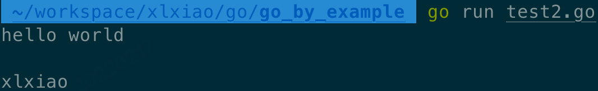

# Golang 正则小试


本文主要记录了日常开发中关于 Golang 正则的一些尝试。主要包括 `""` 和 `` 的区别，贪婪模式和非贪婪模式等。


## 1. `""` 和 `` 的区别
首先介绍下 `""` 和 `` 的区别，因为在后文中会用到相关知识。

`""` 就是正常的字符串，但是会做字符串转义。

```go
package main

import "fmt"

func main() {
    str := "hello world\n\nxlxiao"

    fmt.Println(str)
}
```

输出如下：


`` 原始字符串，不会做字符串转义。

```go
package main

import "fmt"

func main() {
    str := `hello world\n\nxlxiao`

    fmt.Println(str)
}
```

输出如下：
 

## 2. 一个小需求引发的案例
通过正则匹配出仓库 "git@github.com:lesliexlxiao/game-of-life.git" 中 lesliexlxiao。

几种正则对比：
```go
// 可以匹配成功，但是 . 表示匹配任意一个字符，所以 git@github.com:lesliexlxiao/game-of-lifeagit 也能匹配成功。
regexp.Compile("github.com:(.*)/.*.git") 

// 报错，unknown escape sequence，在双引号中 \ 需要转义
regexp.Compile("github.com:(.*)/.*\.git")

// 修复上述 case，可以正确匹配
regexp.Compile("github.com:(.*)/.*\\.git")

// 可以正确匹配，`` 是原始字符串，\ 不需要转义，具体原因可以参照 1
regexp.Compile(`github.com:(.*)/.*\.git`)

// 不能正确匹配，只可以匹配 "git@github.com:lesliexlxiao/game-of-life\\.git"
regexp.Compile(`github.com:(.*)/.*\\.git`) 
```

所以最后的最优解如下：
```go
package main

import (
    "fmt"
    "regexp"
)

func main() {
    repo := "git@github.com:lesliexlxiao/game-of-life.git"
    
    reg := regexp.MustCompile(`git@github.com:(.*)/.*\.git`)

    matches := reg.FindStringSubmatch(repo)
    
    if len(matches) >= 2 {
        fmt.Println(matches[1])
    }
}

```

输出如下：
 

## 3. 贪婪模式和非贪婪模式
为什么会引出贪婪模式和非贪婪模式？因为用到了 reg.FindString，但是 golang 基础库里面还有函数 reg.FindAllString。

对比之后发现 reg.FindString，但是 reg.FindString 为非贪婪模式，而 reg.FindAllString 为贪婪模式。

那么什么是贪婪模式和非贪婪模式？

非贪婪模式：在整个表达式匹配成功的前提下，尽可能少的匹配。

贪婪模式：在整个表达式匹配成功的前提下，尽可能多的匹配。

验证 reg.FindString：
```go
package main

import (
    "fmt"
    "regexp"
)

func main() {
    repo := "paranormal"
    
    reg := regexp.MustCompile(`a.`)

    matches := reg.FindString(repo)
    
    fmt.Println(matches)
}
```

 

从上述结果可以看出，只匹配出 ar，做到了尽可能少的匹配。

验证 reg.FindAllString：
```go
package main

import (
    "fmt"
    "regexp"
)

func main() {
    repo := "paranormal"
    
    reg := regexp.MustCompile(`a.`)

    matches := reg.FindAllString(repo, -1)
    
    fmt.Println(matches)
}
```

 

从上述结果可以看出，匹配出了 [ar an al]，做到了尽可能多的匹配。


## 4. 参考文献
[1] http://www.9lyp.com/article/info/details/id/70.

[2] https://www.cnblogs.com/admans/p/11955614.html.
