# Jenkins 常用插件介绍

本文主要介绍了 Jenkins 的一些常用插件。

## 1. 常用插件介绍
### 1.1 CAS Plugin
用于 CAS 接入。

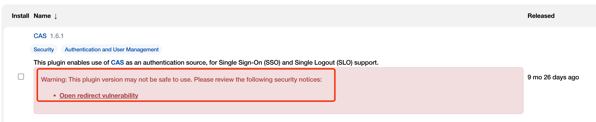

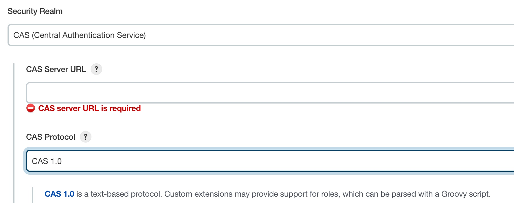

### 1.2 Matrix Authorization Strategy Plugin
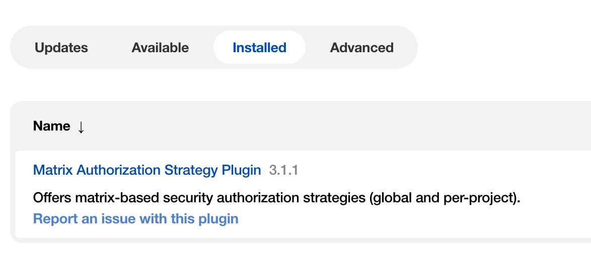

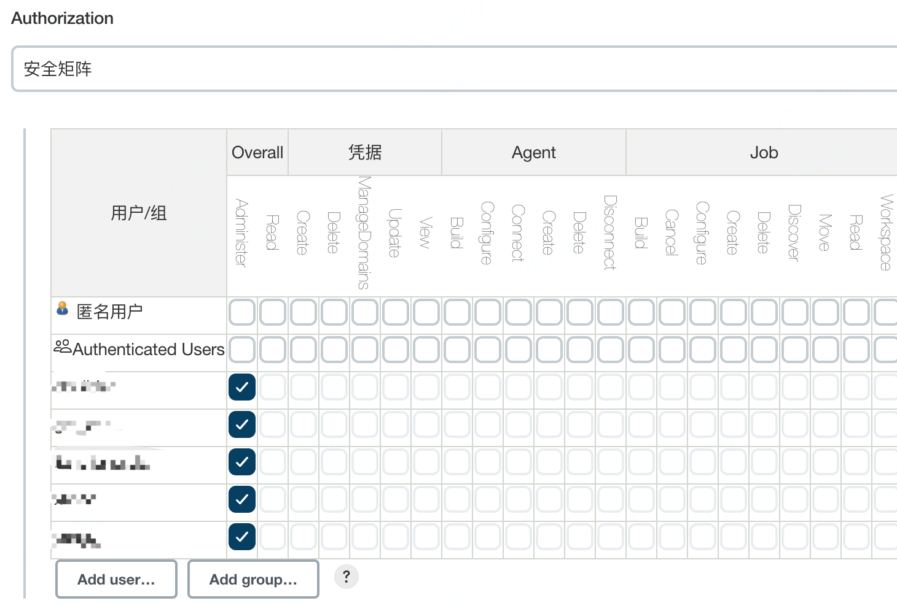

### 1.3 Pipeline Plugin
用来创建 Pipeline Job。如果不配置，创建 Job 时将不会有下面的选项。

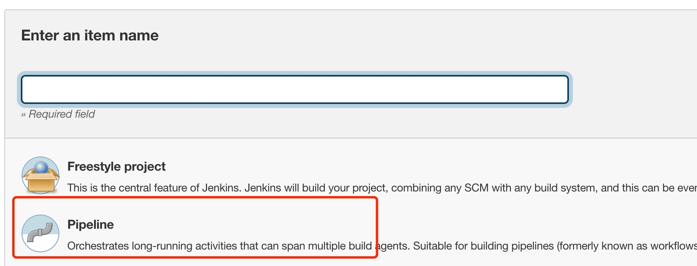

### 1.4 Timestamper Plugin
Adds timestamps to the Console Output，没有装该插件的报错如下：

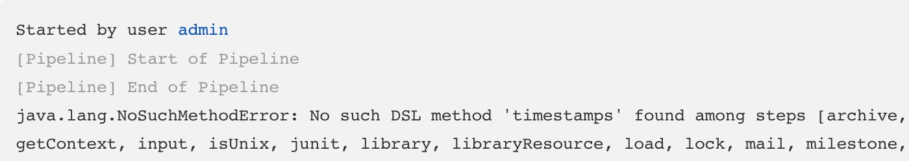

### 1.5 Pipeline Utility Steps Plugin
Utility steps for pipeline jobs，没有装该插件的报错如下：

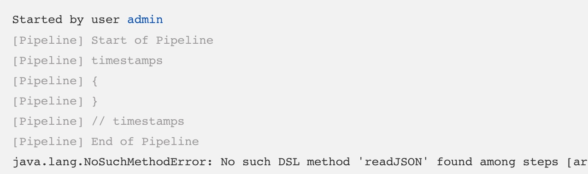

### 1.6 Git Plugin
This plugin integrates Git with Jenkins，如果不配置，Pipeline script from SCM 时无法选择到 git：
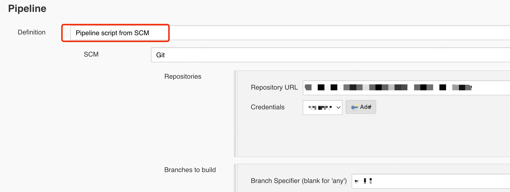

## 1.7 Kubernetes Plugin
This plugin integrates Jenkins with kubernetes。

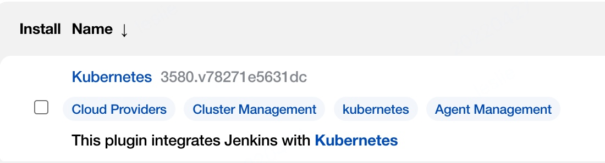

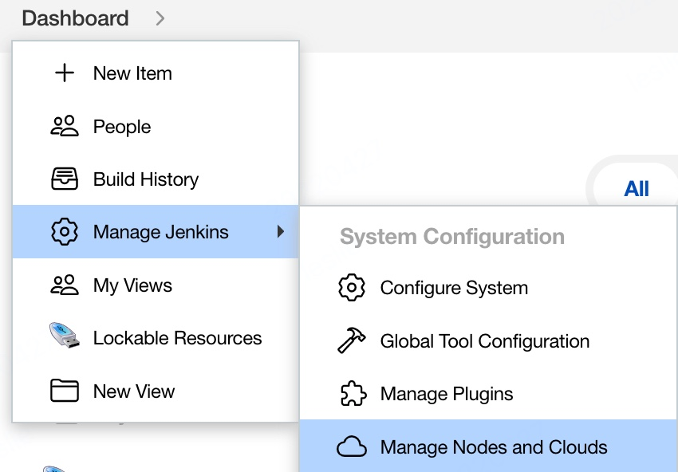

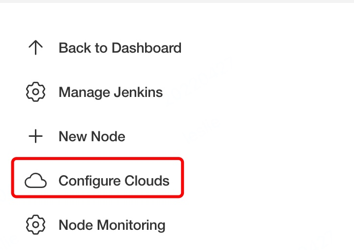

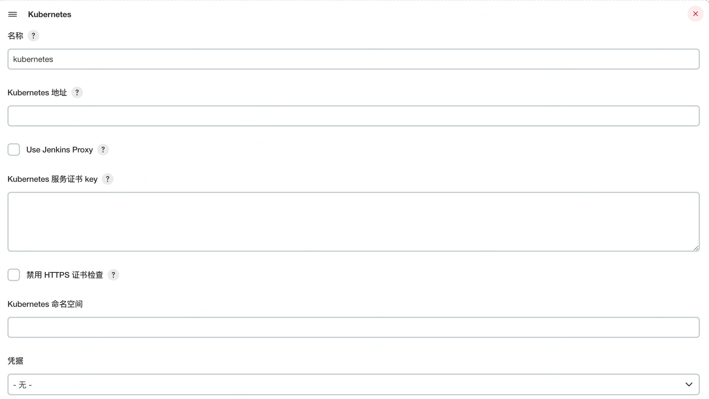

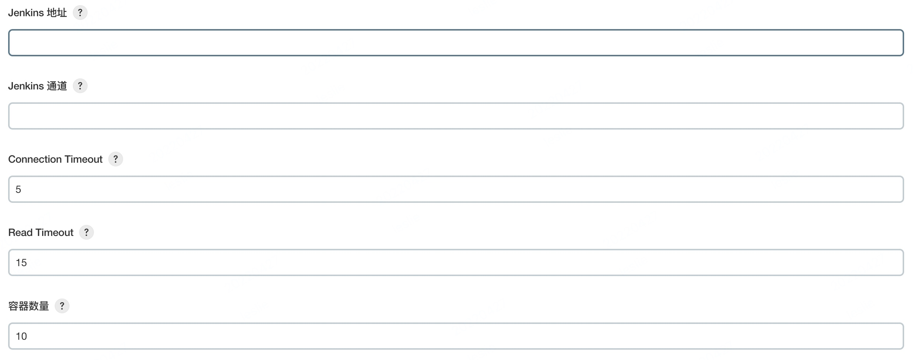

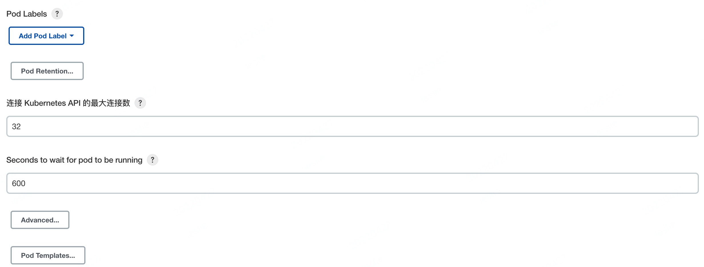

## 2. 携程 build 使用的插件
主要包括：CAS、Matrix Authorization Strategy、Pipeline、Timestamper、Pipeline Utility Steps、Git、Kubernetes 等。

