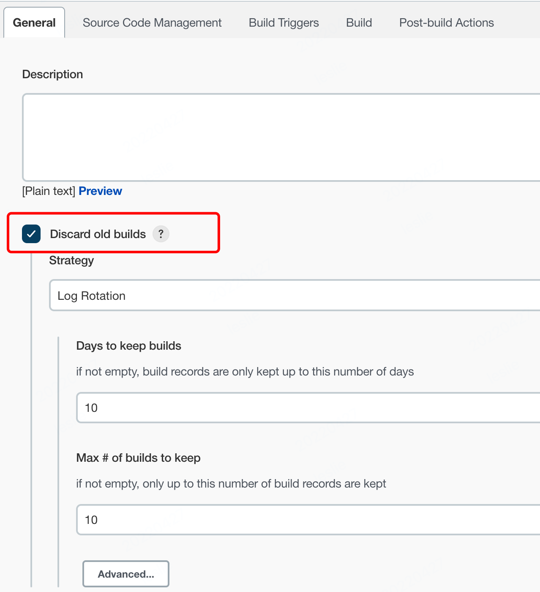

# 一文带你玩转 Jenkins


## 1. 实验环境
本次实验采用的机器为 MAC。

需要预装的软件：Docker。

## 2. 构建 Jenkins Master 镜像
首先请先下载我的个人项目 [jenkins-alpine-dockerfiles](https://github.com/lesliexlxiao/jenkins-alpine-dockerfiles)。该项目是从 Jenkins 官方项目剥离出的简化版 Dockerfile。基于该项目可以构建出 jenkins-master、jenkins-slave 镜像。

下载完成后，开始构建镜像。

构建命令如下：
```shell
docker build \
  --build-arg HTTPS_PROXY=your-proxy \
  --build-arg HTTP_PROXY=your-proxy \
  -t jenkins-master:2.345 -f master/Dockerfile ./master
```

构建说明：
  - 构建时需要添加自己的 PROXY，如果不添加 PROXY，由于需要访问一些国外的站点，很有可能导致构建失败。如果不需要配置 PROXY，去除命令中的 PROXY 即可。

  - 为什么镜像的 tag 是 2.345？因为写这篇博客时，官方最新的版本为 2.345，而我的个人项目 [jenkins-alpine-dockerfiles](https://github.com/lesliexlxiao/jenkins-alpine-dockerfiles) 用的也是这个版本。

构建结果如下：


## 3. 启动 Jenkins Master
预处理：
``` shell
mkdir -p /tmp/jenkins_home

# 和容器保持一致
sudo chown -R 1000:1000 /tmp/jenkins_home

# 修改权限，否则会报如下报错
sudo chmod 777 /tmp/jenkins_home
```


启动命令如下：
```shell
docker run --name jenkins-master \
  -p 8080:8080 -v /tmp/jenkins_home:/var/jenkins_home -d jenkins-master:2.345
```

启动说明：
  - -v /tmp/jenkins_home:/var/jenkins_home 表示将<font color=#FF0099>**宿主机目录 /tmp/jenkins_home**</font> 挂载到<font color=#FF0099>**容器目录 /var/jenkins_home**</font> 下。

启动结果：


访问地址：[http://127.0.0.1:8080/](http://127.0.0.1:8080/)


进入容器，查看 /var/jenkins_home/secrets/initialAdminPassword 内容（或直接查看宿主机 /tmp/jenkins_home/secrets/initialAdminPassword 内容），并填入上图中。

安装插件，<font color=#FF0099>**初始建议不安装任何插件，直接点击下图 X 即可**</font>。一旦选择 Install suggested plugins，Jenkins 会默认装上一堆插件，<font color=#FF0099>**这会导致你不清楚安装的每一个插件的具体功能**</font>。可以后期用到一个插件，便去研究一个插件的特性，从而打到庖丁解牛的目的。


点击 Start using Jenkins。


至此，Jenkins Master 启动完毕。

<font color=#FF0099>**为了方便后面的登录，可以新创建一个管理员账户和密码。**</font>


## 4. 创建 Job 并完成构建

### 4.1 创建 Job


### 4.2 配置 Job

1. General 配置：



2. Build 配置：


### 4.3 构建
1. 构建：


2. 查看构建日志：


## 5. 升级 Jenkins Master
访问 https://updates.jenkins-ci.org/download/war/ 地址，找到最新版本 Jenkins 的 <font color=#FF0099>**SHA-256**</font> 值。替换 [jenkins-alpine-dockerfiles](https://github.com/lesliexlxiao/jenkins-alpine-dockerfiles) 项目 master 目录下 Dockerfile 文件的 <font color=#FF0099>**Jenkins 版本号**</font>和 <font color=#FF0099>**JENKINS_SHA**</font> 的值。


参照第 2 小节，重新构建镜像，基于该镜像启动新的 Jenkins 容器，这样 Jenkins 就升级完成了（<font color=#FF0099>**这边不考虑插件的升级**</font>）。

## 6. 常用插件安装及升级
常用插件安装请参照文章：[https://www.lesliexlxiao.com/jenkins-common-plugins/](https://www.lesliexlxiao.com/jenkins-common-plugins/)

如何加速插件安装，将插件源替换成 [https://mirrors.tuna.tsinghua.edu.cn/jenkins/updates/update-center.json](https://mirrors.tuna.tsinghua.edu.cn/jenkins/updates/update-center.json) 即可。


<font color=#FF0099>**注意：更新完插件源之后，重启下 Jenkins。**</font>
