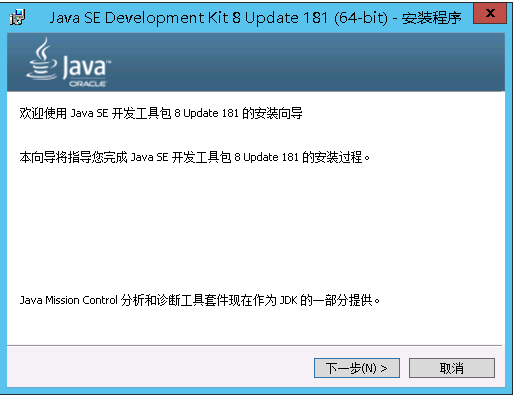
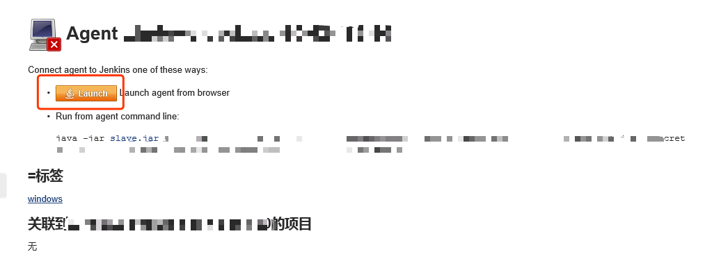
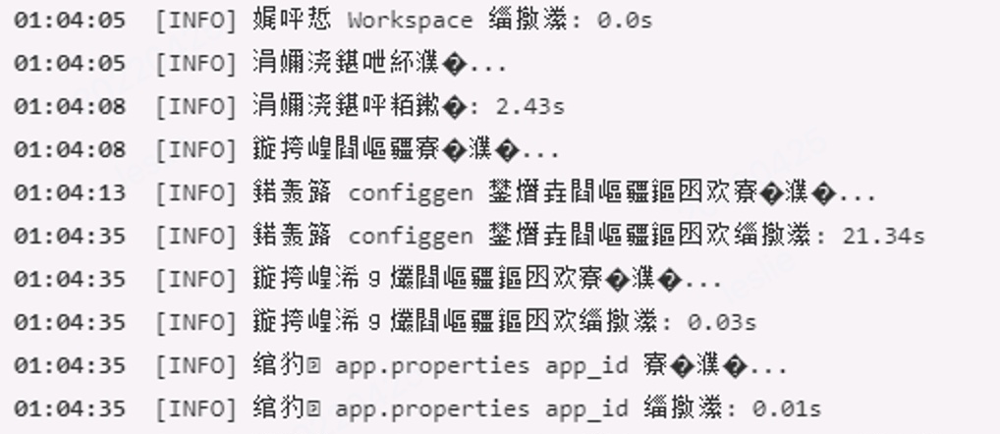

# Windows 环境下如何添加 jenkins-slave 节点


本文主要介绍了 Windows 环境下如何添加 jenkins-slave 节点，以及安装过程中一些常见问题如何解决。

<!--more-->

## 1. 实验环境

本次实验采用服务器为 Windows Server 2012。

实验中安装软件的版本均为本次实验采用的版本。


## 2. 预装软件

### 2.1 JDK 安装

作用：jenkins-slave 服务启动依赖于 JDK。

下载：[下载地址](https://www.oracle.com/technetwork/java/javase/downloads/jdk8-downloads-2133151.html)。

安装：按照下图连续点击下一步即可。



验证：打开 Windows PowerShell，输入如下命令进行验证：

```shell
C:\Users\xlxiao> java -version

----------output----------
java version "1.8.0_181"
Java(TM) SE Runtime Environment (build 1.8.0_181-b13)
Java HotSpot(TM) 64-Bit Server VM (build 25.181-b13, mixed mode)
```

### 2.2 Ruby 安装

安装版本：ruby2.3.3。

作用：如果执行 jenkins 任务使用的脚本语言是 Ruby 编写，则需要安装 Ruby。

下载：[下载地址](https://rubyinstaller.org/downloads/)。

安装：按照下图连续点击下一步即可。


验证：打开 Windows PowerShell，输入如下命令进行验证：

```shell
C:\Users\xlxiao> ruby -v

----------output----------
ruby 2.3.3p222 (2016-11-21 revision 56859) [x64-mingw32]
```

### 2.3 Git 安装
作用：构建任务的脚本语言中如果使用 Git 下载代码，则需要安装 Git。

下载地址：<a href>https://git-scm.com/download/win</a>。

安装：按照下图连续点击下一步即可。


验证：打开 Windows PowerShell，输入如下命令进行验证：
```shell
C:\Users\xlxiao> git version

----------output----------
git version 2.21.0.windows.1
```

## 3. 添加 slave 节点

### 3.1 主节点添加 slave 节点


### 3.2 安装 jenkins-slave 服务
进入页面 <a href>http://192.168.2.1:8080/</a>，点击如下刚刚配置的未在线 windows-192-168-2-2。


进入 <a href>http://192.168.2.1:8080/computer/windows-192-168-2-2/</a>，点击 Launch 进行安装。



安装为 windows service。


查看 jenkins-slave 服务，打开任务管理器，查看服务。


## 4. 常见问题

### 4.1 Cannot run program "nohup"

报错信息：java.io.IOException: Cannot run program "nohup"。


报错原因：因为系统没法找到 nohup 执行程序。

解决方案：

  - 将 <font color=FF0099>**C:\Program Files\Git\usr\bin**</font> 添加到 PATH 环境变量，这样系统即找打 nohup 执行程序了。从下图可以看到 nohup 程序确实存在于 C:\Program Files\Git\usr\bin 路径下：


  - <font color=FF0099>**重启 jekins-slave 服务**</font>，如下图所示：


  - 参考：<a href>https://stackoverflow.com/questions/45140614/jenkins-pipeline-sh-fail-with-cannot-run-program-nohup-on-windows/45151156</a>。

### 4.2 Could not read from remote repository

报错信息：Could not read from remote repository。<font color=FF0099>**访问 Gitlab 没有权限**</font>。


报错原因：从下图可以看出 jenkins-slave 服务是以 SYSTEM 用户去启动的，而我们的 <font color=FF0099>**ssh-key 并没有种到 SYSTEM 用户下**</font>，所以没法下载 git 代码。


解决方案 1：

  - 在当前用户生成 ssh-key，并在当前用户下<font color=FF0099>**第一次通过 git clone 命令去访问想要访问的仓库，这时会在 .ssh 目录生成 knows_hosts 文件**</font>。

  - 将生成的 .ssh 目录复制到 <font color=FF0099>**C:\Windows\System32\config\systemprofile\\**</font> 下。

  	

  - 注意：<font color=FF0099>**knows_hosts 文件同样要 copy 到该目录，否则无法访问仓库。**</font>

  - <font color=FF0099>**重启 jenkins-slave 服务。**</font>

解决方案 2：

  - 在当前用户生成 ssh-key，并在当前用户下<font color=FF0099>**第一次通过 git clone 命令去访问想要访问的仓库**</font>。

  - 根据下面的步骤，改变服务登录用户，重启 jenkins-slave 服务。这样 jenkins-slave 就是以<font color=FF0099>**当前用户**</font>启动的了。

  

  

  

### 4.3 bundler/setup LoadError

报错信息：cannot load such file -- bundler/setup (LoadError)


报错原因：没有安装 bundler

解决方案：安装 bundler

```shell
C:\Users\xlxiao> gem source -r https://rubygems.org/
C:\Users\xlxiao> gem source -a 自己公司内部源
C:\Users\xlxiao> gem install bundler
```

### 4.4 构建日志乱码


报错原因：编码设置不正确

解决办法：添加系统环境变量 JAVA_TOOL_OPTIONS，值设置为 -Dfile.encoding=UTF-8


<font color=#FF0099>**注意：设置完系统环境变量之后，必须要重新启动机器才能生效。**</font>

### 4.5 将 jenkins-slave 服务安装成 Windows Service 报错
虽然在 Windows 环境中看上去是安装成功了，但是在服务端查看日志，报错如下：


报错原因：原来 jenkins-slave 作为 Windows Service 安装过，会有残留文件存在，导致报错。

解决办法：
- 第一步：停止 Jenkins 服务。


- 第二步：删除 Jenkins 服务。以管理员身份打开 cmd 窗口，执行命令 "sc delete jenkinsslave-d__jenkins"（<font color=#FF0099>**注意：命令中的是双下划线**</font>）。


- 第三步：删除历史的 jenkins-slave 数据。


- 第四步：将 jenkins-slave 服务安装成 Windows Service。
