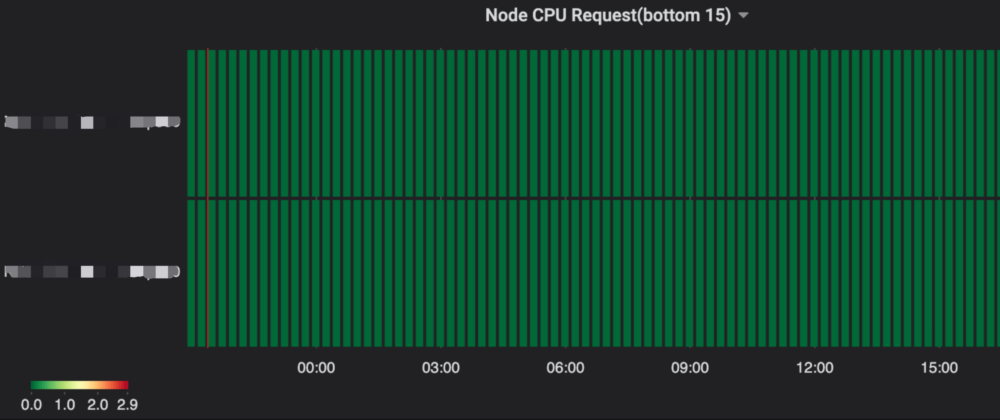
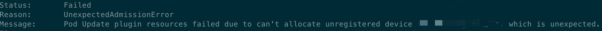
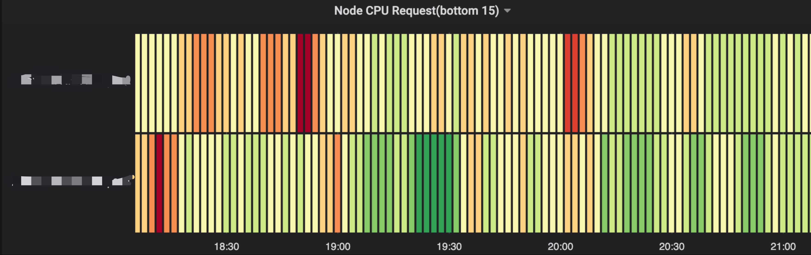

# Pod 无法调度到预期 Node 问题分析

本文主要记录了 k8s 中 pod 无法调度到预期 node 时，如何去进行问题分析。

## 1. 背景
目前携程采用的是 gitlabci 去跑 ci 流程。某一天我们通过监控发现，有两台 node 节点始终不能调度到 executor pod。

## 2. 分析问题
正常情况下 node 被打了污点，而 executor pod 没有配置去容忍该污点，这个时候是没法调度到 node 节点的。但是通过对比分析，pod 已经配置了容忍该污点，仍然无法调度上去。

executor pod 一直在实时生成，node 节点也很多，这个时候我们应该怎么排查问题呢？

这时，可以 copy 出一份 executor pod yml 文件，修改 pod 名字和 node 名字，然后 apply 该 yml 文件。这个时候我们可以看到该 pod 的状态。

然后通过 kubectl describe po test-runner-062k8w -n gitlabci 命令查看具体报错原因：

最终发现是 node 上一个插件有问题，导致调度的时候无法判断还有没有可用 IP。

## 3. 解决问题
重启 node 有问题插件，调度成功。

