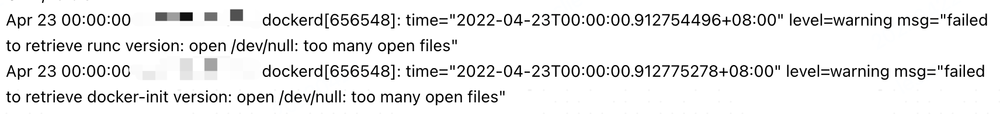
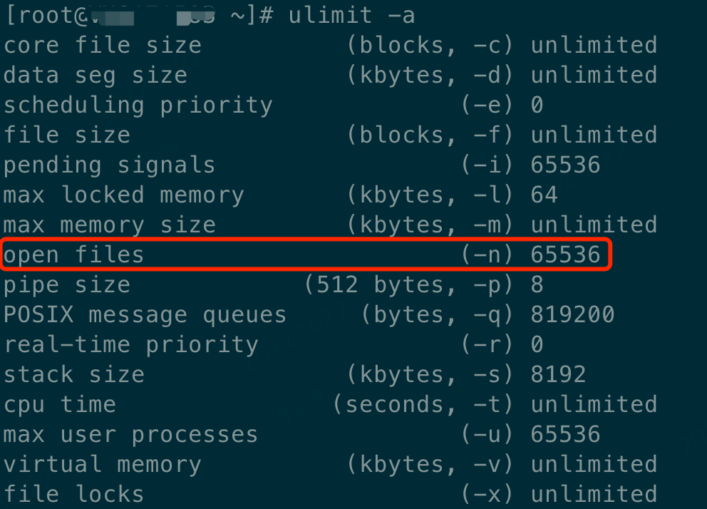
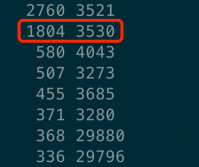
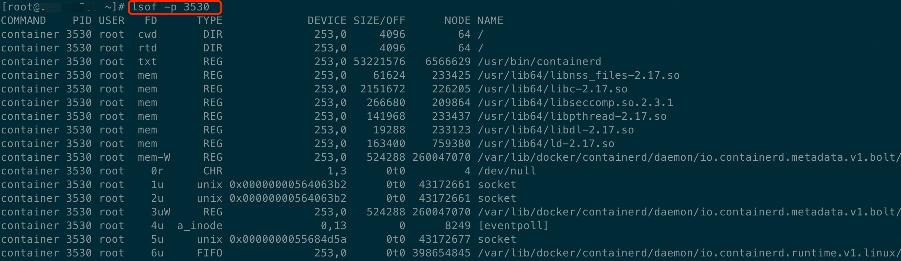
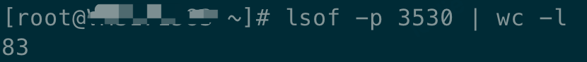

# 如何解决 linux too many open files 问题


本文主要分析了当 linux 系统中出现 too many open files 问题时，我们应该如何去解决这类问题。

<!--more-->

## 1. 带来的问题
如果出现 too many open files 会带来什么呢？
- 应用程序进程启动不了。
- 应用程序进程崩溃。如下图所示，docker 进程崩溃。


## 2. 产生原因
too many open files（打开的文件过多）是 Linux 系统中常见的错误，从字面意思上看就是说程序打开的文件数过多，不过这里的 files 不单是文件的意思，也包括打开的通讯链接（比如 socket），正在监听的端口等等，所以有时候也可以叫做句柄（handle），这个错误通常也可以叫做句柄数超出系统限制。
引起的原因就是进程在某个时刻打开了超过系统限制的文件数量以及通讯链接数，通过命令 ulimit -a 可以查看当前系统设置的最大句柄数是多少。[<sup>1</sup>](#refer-anchor-1)

## 3. 通过命令进行问题分析
### 3.1 查看系统目前允许单个进程打开的最大句柄数
```shell
$ ulimit -a
```


其中 open files (-n) 65536 表示单个进程最大允许打开的句柄数是 65536。

### 3.2 查看当前进程打开了多少个文件句柄
``` shell
$ lsof -n | awk '{print $2}' | sort | uniq -c | sort -nr | more  
```


图中 3530 表示进程 ID，1804 表示打开文件句柄数。

### 3.3 查看单个进程打开了多少个文件句柄
``` shell
$ lsof -n 3530
```


``` shell
$ lsof -n 3530 | wc -l
```


## 4. 解决办法
### 4.1 命令式：增大允许打开的文件数[<sup>1</sup>](#refer-anchor-1)
```shell
$ ulimit -n 2048
```
这样就可以把当前用户的最大允许打开文件数量设置为 2048 了，但这种设置方法在<font color=#FF0099>**重启后会还原为默认值**</font>。

ulimit -n 命令非 root 用户只能设置到 4096。

想要设置到 8192 需要 sudo 权限或者 root 用户。


### 4.2 修改系统配置文件：增大允许打开的文件数[<sup>1</sup>](#refer-anchor-1)
```shell
$ vim /etc/security/limits.conf

# 在最后加入
* soft nofile 4096
* hard nofile 4096
```

或者只加入
```shell
* - nofile 8192
```

最前的 * 表示所有用户，可根据需要设置某一用户，例如
```shell
leslie soft nofile 8192
leslie hard nofile 8192
```

注意：nofile 项有两个可能的限制措施。就是项下的 hard和 soft。要使修改过得最大打开文件数生效，必须对这两种限制进行设定。如果使用 - 字符设定, 则 hard 和 soft 设定会同时被设定。

### 4.3 检查程序问题
如果你对你的程序有一定的解的话，应该对程序打开文件数（链接数）上限有一定的估算，如果感觉数字异常，请使用第一步的 lsof -p 进程id > openfiles.log 命令，获得当前占用句柄的全部详情进行分析。


1）打开的这些文件是不是都是必要的？

2）定位到打开这些文件的代码

3）是否程序操作了文件写入，但是没有进行正常关闭

4）是否程序进行了通讯，但是没有正常关闭(也就是没有超时结束的机制)


如果程序中存在这些问题的话，无论系统句柄数设置的多么大，随着时间的推移，也一定会占用完。


## 5. 参考文献
<a id="chapter-1"></a>
[1] https://blog.csdn.net/Roy_70/article/details/78423880.

[2] https://matianxin.github.io/2020/06/01/Linux/TooManyOpenFiles.
