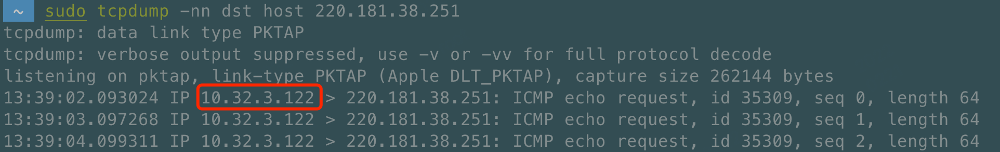
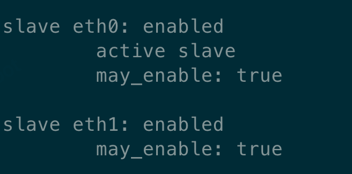

# tcpdump 小试


本文主要对 tcpdump 做了些简单介绍，以及一些实践经验。

## 1. 什么是 tcpdupm
tcpdump：dump the traffic on a network，根据使用者的定义对网络上的数据包进行截获的包分析工具。

## 2. 安装 tcpdump
```
yum install -y tcpdump
```

## 3. 命令参数简介
- 普通情况下，直接启动 tcpdump 将监视第一个网络接口上所有流过的数据包。
```shell
tcpdump
```

- 数字的方式显示 IP 和端口。一个 n 是 ip。如果不指定 --n，下图标红的地方展示的是 hostname：VMS2445。
```shell
tcpdump --n 
```



- 监视指定网络接口的数据包。如果不指定网卡，默认 tcpdump 只会监视第一个网络接口，一般是 eth0。
```shell
tcpdump -i eth1
```

- 截获所有 210.27.48.1 的主机收到的和发出的所有的数据包
```shell
tcpdump host 210.27.48.1 
```

- 截获所有发送到机器 210.27.48.1 10000 端口的包
```shell
tcpdump -nn -i eth1 dst host 210.27.48.1 and port 10000
```

## 4. ovs 模式下 eth 主备
```shell
ovs-appctl bond/show
```


## 5. 参考
[1] https://www.cnblogs.com/ggjucheng/archive/2012/01/14/2322659.html.
