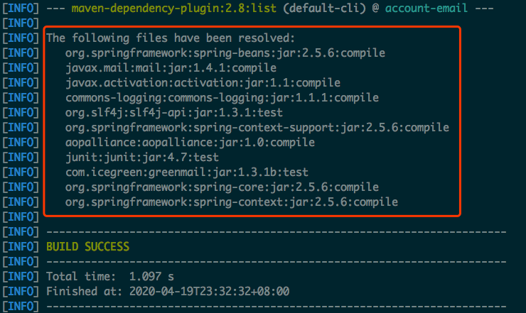
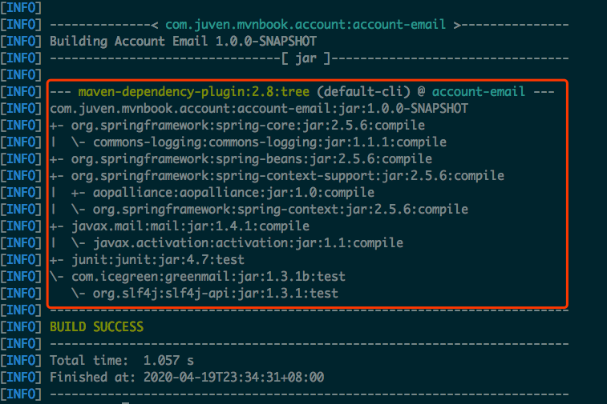
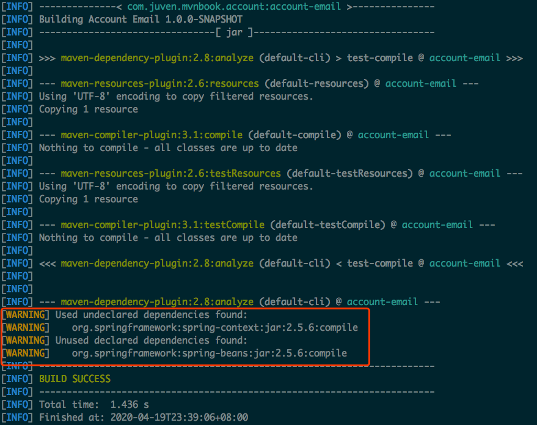

# [笔记]Maven 项目依赖最佳实践


本文主要介绍了 Maven 依赖相关的一些<font color=FF0099>**最佳实践**</font>，用来避免和处理很多常见的问题。

## 1. 排除依赖
传递性依赖会给项目隐式地引入很多依赖，极大地简化了项目依赖的管理，但是这种特性也会带来问题。这种情况下，可以通过<font color=FF0099>**排除依赖**</font>来解决问题，下面列举两种情况：

  - 情况一：项目 A 有一个依赖，而这个依赖又依赖了另一个类库的 SNAPSHOT 版本，那么这个 SNAPSHOT 就会成为项目 A 的传递性依赖，<font color=FF0099>**SNAPSHOT 的不稳定性会直接影响到项目**</font>。这时需要排除掉 SNAPSHOT，并且在当前项目中声明该类库的正式发布版本。

  - 情况二：项目 A 依赖于 Hibernate，而 Hibernate 依赖于 Sun JTA API，但是<font color=FF0099>**由于版权因素，Sun JTA API 不在中央仓库中**</font>，而 Apache Geronimo 项目中有一个对应的实现。这时可以排除 Sun JTA API 依赖，再声明 Geronimo 中 JTA API 实现。

下面是一个排除依赖的示例：
```xml
<project>
    <model>4.0.0</model>
    <groupId>com.juvenxu.mvnbook</groupId>
    <artifactId>project-a</artifactId>
    <version>1.0.0</version>
    <dependencies>
        <dependency>
            <groupId>com.juvenxu.mvnbook</groupId>
            <artifactId>project-b</artifactId>
            <version>1.0.0</version>
            <exclusions>
                <exclusion>
                    <groupId>com.juvenxu.mvbook</groupId>
                    <artifactId>project-c</artifactId>
                </exclusion>
            </exclusions>
        </dependency>
        <dependency>
            <groupId>com.juvenxu.mvbook</groupId>
            <artifactId>project-c</artifactId>
            <version>1.0.0</version>
        </dependency>
    </dependencies>
</project>
```

注意：声明 exclusion 的时候只需要 groupId 和 artifactId，而不需要 version 元素，这时因为<font color=FF0099>**只需要 groupId 和 artifactId 就能唯一定位依赖图中的某个依赖**</font>。

## 2. 归类依赖
所谓的归类依赖，就是<font color=FF0099>**把具有相同值的依赖属性抽象出来**</font>，方便后期的升级和维护。

下面是以个归类依赖的示例：
```xml
<project>
    <modelVersion>4.0.0</modelVersion>
    <groupId>com.juven.mvnbook.account</groupId>
    <artifactId>account-email</artifactId>
    <name>Account Email</name>
    <version>1.0.0-SNAPSHOT</version>

    <properties>
        <springframework.version>2.5.6</springframework.version>
    </properties>

    <dependencies>
        <dependency>
            <groupId>org.springframework</groupId>
            <artifactId>spring-core</artifactId>
            <version>${springframework.version}</version>
        </dependency>
        <dependency>
            <groupId>org.springframework</groupId>
            <artifactId>spring-beans</artifactId>
            <version>${springframework.version}</version>
        </dependency>
        <dependency>
            <groupId>org.springframework</groupId>
            <artifactId>spring-context-support</artifactId>
            <version>${springframework.version}</version>
        </dependency>
    </dependencies>
</project>
```

这里使用 <font color=FF0099>**properties 元素**</font>来定义 Maven 属性。上述示例中定义 springframework.version 属性值为 2.5.6 。有了这个属性之后，Maven 运行的时候会将 POM 中的所有的 ${springframework.version} 替换为实际值 2.5.6。

## 3. 优化依赖
在构建 Maven 项目时，我们应该对 Maven 项目的依赖了然于胸，并对其进行优化，如<font color=FF0099>**去除多余的依赖，显示地声明某些必要的依赖**</font>。

Maven 能够自动解析所有项目的直接依赖和传递性依赖，解决依赖冲突，最后得到那些依赖的已解析依赖（Resolved Dependencies）。可以通过如下命令查看当前项目的已解析依赖：

```shell
$ mvn dependency:list
```

下图展示了所有 account-email 的已解析依赖，同时，<font color=FF0099>**每个依赖的范围**</font>也得以明确标示：



依赖经过 Maven 解析后，会构成一个依赖树，通过依赖树能够很清楚地看到某个依赖是通过哪条路径引入的。可以通过如下命令查看当前项目的依赖树：

```shell
$ mvn dependency:tree
```

下图展示了 account-email 项目的依赖树：



使用 <font color=FF0099>**dependency:list**</font> 和 <font color=FF0099>**dependency:tree**</font> 可以帮助我们详细了解项目中所有依赖的具体信息。在此基础上使用 <font color=FF0099>**dependency:analyze**</font> 工具可以帮助分析当前项目的依赖，从而<font color=FF0099>**优化项目依赖**</font>。

去除 spring-context 依赖，对 account-email 项目执行如下命令：

```shell
$ mvn dependency:analyze
```

结果如下图所示：



<font color=FF0099>**Used undeclared dependencies**</font>，指项目中使用到的，但是没有显式声明的依赖，这里是 spring-context。通过上面 dependency:tree 的结果可以看出，spring-context 是通过 spring-context-support 依赖传递进来的。<font color=FF0099>**当升级 spring-context-support 这种直接依赖时，相关传递性依赖如 spring-context 的版本也可能发生变化，这种变化不易察觉，但是有可能导致当前项目报错**</font>。例如由于接口的改变，当前项目中的相关代码无法编译。这种隐藏的、潜在的威胁一旦出现，往往需要耗费大量的时间来查明真相。因此，<font color=FF0099>**显式声明任何项目中直接用到的依赖**</font>。

<font color=FF0099>**Unused declared dependencies**</font>，指项目中未使用的，但是显式声明的依赖，这里有 spring-beans。对于这样一类依赖，我们不应该简单地直接删除其声明，而是应该仔细分析。由于 dependency:analyze <font color=FF0099>**只会分析编译主代码和测试代码用到的依赖，一些执行测试和运行时需要的依赖它就发现不了**</font>。很显然，该例中 spring-beats 是运行 Spring Framework 项目必要的类库，因此<font color=FF0099>**不应该删除依赖声明**</font>。

## 4. 参考文献
[1] 许晓斌.Maven 实战[M].北京:机械工业出版社,2010:68-74.
