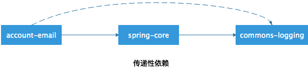

# [笔记]Maven 项目依赖介绍


本文主要介绍了 Maven 项目<font color=FF0099>**依赖的配置、依赖范围、传递性依赖范围、依赖调解和可选依赖**</font>相关内容。

## 1. 依赖的配置
一个依赖声明可以包含如下元素
```xml
<project>
    ...
    <dependencies>
        <dependency>
            <groupId>...</groupId>
            <artifactId>...</artifactId>
            <version>...</version>
            <type>...</type>
            <scope>...</scope>
            <optional>...</optional>
            <exclusions>
                <exclusion>
                ...
                </exclusion>
            ...
            </exclusions>
        </dependency>
    ...
    </dependencies>
    ...
</project>
```

type：依赖的类型，<font color=FF0099>**对应于项目坐标定义的 packaging。**</font>

scope：依赖的范围。

optional：标记依赖是否可选。

exclusions：用来排除传递性依赖。


## 2. 依赖范围
Maven 相关的三种 classpath：编译 classpath、测试 classpath、运行 classpath。

Maven 在编译项目主代码的时候，用到的文件以依赖方式被引入到<font color=FF0099>**编译 classpath 中**</font>。

Maven 在编译和执行测试的时候，用到的文件以依赖方式被引入到<font color=FF0099>**测试 classpath 中**</font>。

实际运行 Maven 项目的时候，用到的文件以依赖方式被引入到<font color=FF0099>**运行 classpath 中**</font>。

Maven 有以下几种依赖范围：

  - compile：编译依赖范围。如果没有指定，就会默认使用该依赖范围。

  - test：测试依赖范围。

  - provided：已提供依赖范围。

  - runtime：运行时依赖范围。

  - system：系统依赖范围。该依赖范围与三种 classpath 的关系，和 provided 依赖范围是一样的。但是，使用该范围的依赖时<font color=FF0099>**必须通过 systemPath 元素显式地指定依赖文件的路径。**</font> 此类依赖不是通过 Maven 仓库解析的，往往与本机系统绑定，可能造成构建的不可移植，<font color=FF0099>**因此应该慎用**</font>。例子如下：

  ```xml
  <dependency>
    <groupId>javax.sql</groupId>
    <artifactId>jdbc-stdext</artifactId>
    <version>2.0</version>
    <scope>system</scope>
    <systemPath>${java.home}/lib/rt.jar</systemPath>
  </dependency>
  ```


下表展示了依赖范围与三种 classpath 的关系：

|  依赖范围（scope）   | 对于编译 classpath 有效 | 对于测试 classpath 有效 | 对于运行时 classpath 有效 | 例  子 |
|  :----:  | :----: | :----: | :----: | :----: |
| compile  | Y | Y | Y | spring-core |
| test  | — | Y | — | Junit |
| provided  | Y | Y | — | servlet-api |
| runtime  | — | Y | Y | JDBC 驱动实现 |
| system  | Y | Y | — | 本地的，Maven 仓库之外的类库 |


## 3. 传递性依赖

### 3.1 何为传递性依赖
假设我们的应用为 account-email，它有一个 spring-core 依赖，而 spring-core 有一个 commons-logging 依赖，那么 <font color=FF0099>**commons-logging 是 account-email 的一个传递性依赖。**</font>




### 3.2 传递性依赖范围
下表最左边一列表示第一直接依赖范围，最上面一行表示第二直接依赖范围，中间交叉单元格表示传递性依赖范围。

|     | compile | test | provided | runtime |
|  :----:  | :----: | :----: | :----: | :----: |
| compile  | compile  | — | — | runtime |
| test     | test     | — | — | test |
| provided | provided | — | provided | provided |
| runtime  | runtime  | — | — | runtime |

可以通过一个例子来理解上面这个表格。account-email 有一个 spring-core 的直接依赖，我们说这是第一直接依赖，其依赖范围是 compile；spring-core 又有一个 commons-logging 的直接依赖，我们说这是第二直接依赖，其依赖范围是 compile。那么 commons-logging 是 ccount-email 的传递性依赖，对照上表可以知道，<font color=FF0099>**第一直接依赖范围是 compile，第二直接依赖范围是 compile 时，传递性依赖范围是 compile。**</font>

## 4. 依赖调解
依赖调解主要遵循两个规则：
   - <font color=FF0099>**路径最近者优先**</font>。比如 A->B->C->X(1.0)，A->D->X(2.0)，那么此时 X(2.0) 会被解析使用。

   - <font color=FF0099>**第一声明者优先**</font>。比如 A->B->Y(1.0)，A->B->Y(1.0)，因为两条依赖路径的长度是一样的，那么就得遵循第一声明者优先原则。如果 B 声明在 C 之前，那么此时 Y(1.0) 会被解析使用。

## 5. 可选依赖
假如有这样一个依赖关系：A->B、B->X(可选依赖)、B->Y(可选依赖)，那么 X、Y 将不会对 A 有任何影响，因为<font color=FF0099>**可选依赖不会得以传递**</font>。

为什么需要可选依赖？可能项目 B 实现了两个特性，其中的特性一依赖于 X，特性二依赖于 Y，而且这两个特性是互斥的，用户不可能同时使用两个特性。<font color=FF0099>**如果不设置可选依赖，那么 X、Y 都会被传递给 A，造成冲突。**</font>比如 B 是一个持久层隔离工具包，它支持多种数据库，包括 MySQL、PostgreSQL 等，在构建工具包的时候，需要这两种数据库的驱动程序，但在使用这个工具包的时候，只会依赖某种数据库。

项目 B 依赖声明如下：
```xml
<project>
    <modelVersion>4.0.0</modelVersion>
    <groupId>com.juvenxu.mvnbook</groupId>
    <artifactId>project-b</artifactId>
    <version>1.0.0</version>
    <dependencies>
        <dependency>
            <groupId>mysql</groupId>
            <artifactId>mysql-connector-java</artifactId>
            <version>5.1.0</version>
            <optional>true</optional>
        </dependency>
        <dependency>
            <groupId>postgresql</groupId>
            <artifactId>postgresql</artifactId>
            <version>8.4-701.jdbc3</version>
            <optional>true</optional>
        </dependency>
    </dependencies>
</project>
```

上述 XML 中 optional 为 true，它们只会对当前项目 B 产生影响。此时由于 mysql、postgresql 依赖都不会被传递个 A，所以当 A 使用 MySQL 数据库时，就需要<font color=FF0099>**显式地声明 mysql-connector-java 这一依赖。**</font>

在理想情况下，是不应该使用可选依赖的。面向对象设计中，有个单一职责原则，即<font color=FF0099>**一个类只有一项职责**</font>。所以针对上述例子，更好的做法是为 MySQL 和 PostgreSQL 分别创建一个 Maven 项目。将 B 拆分为两个项目 C 和 D，C 和 D 中声明对应的 JDBC 驱动依赖，那么此时 A 就可以根据需求去选择使用 C 或者 B 依赖。

## 6. 参考文献
[1] 许晓斌.Maven 实战[M].北京:机械工业出版社,2010:62-68.
