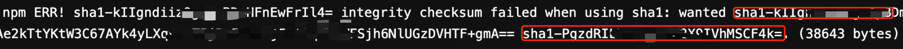

# npm install checksum failed 问题分析

本文主要记录了 npm intall checksum failed 问题分析的过程。

## 1. 背景
用户报障说 gitlabci npm install 构建经常报错，时好时坏。报错日志如下：

## 2. 分析问题
日志报错分析：当前的 integrity sha1（这个值可以在 package-lock.json 中查找）的值和实际获取到的值（服务端获取到的值）不一致导致报错。

哪些原因导致 npm 包的唯一识别码发生了变化？上面的案例，发生的场景如下：

- 用户先 publish 1.0.0 版本，然后 unpublish 1.0.0 版本，最后重新 publish 1.0.0 版本，这时服务端版本 sha1 值发生了变化。

那么为什么 gitlabci 构建时好时坏呢？具体情形如下：

- 有缓存的机器可以构建成功。

- 无缓存的机器构建失败。

这里就需要去了解下 npm install 的机制了，大致步骤如下：

- a. 到 node_modules 目录查看有没有对应的包版本，如果有，更新到 cache 目录；
- b. 到 cache 目录查看有没有对应包的 cache；
- c. 有 cache，unpack 对应的包到 node_modules；
- d. 没有 cache，到 npm 源下载对应的包并且校验 integrity。

这里要声明下 gitlabci 构建的 pod 是用完就销毁的，所以每次构建都会生成新的 node_modules 目录。

有缓存的机器可以构建成功分析：
- 到 cache 目录查看有没有对应包的 cache；
- 把 cache unpack 到 node_moudles;
- npm install 发现 node_moudles 有对应的包，不再去 npm 源下载，也就不会校验 integrity，此时构建成功。

无缓存的机器构建失败分析：
- 到 npm 源下载对应的包并且校验 integrity，构建失败。

## 3. 解决办法
方法一：删除 package-lock.json 文件，重新生成正确的 package-lock.json 文件。
- 弊端：删除 package-lock.json，可能会导致一些依赖包的版本升级，导致一些意想不到的错误。

方法二：替换 package-lock.json 对应依赖包的 sha1 值为服务端实际获取到的值。下图红框第一处为 package-lock.json 中的值，第二处为服务端实际获取的值。

