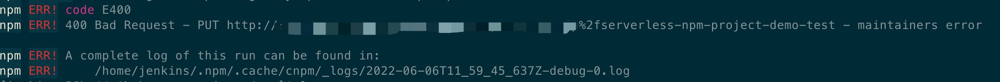
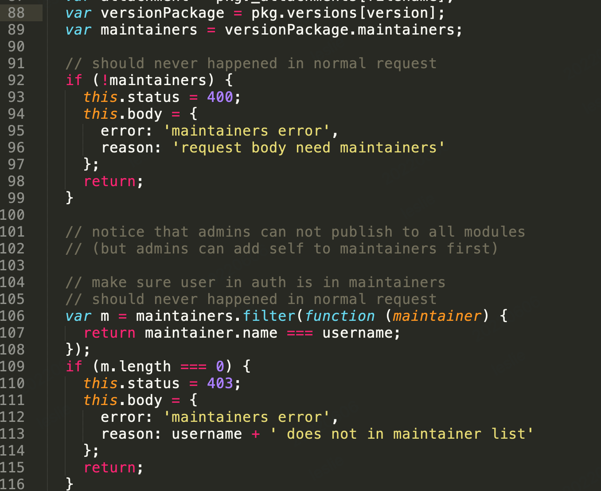
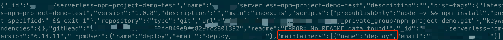
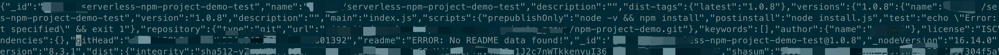
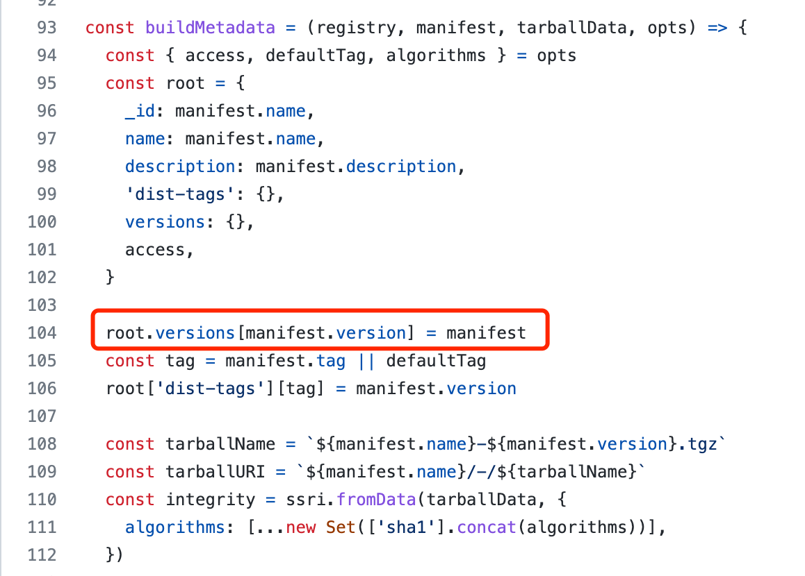
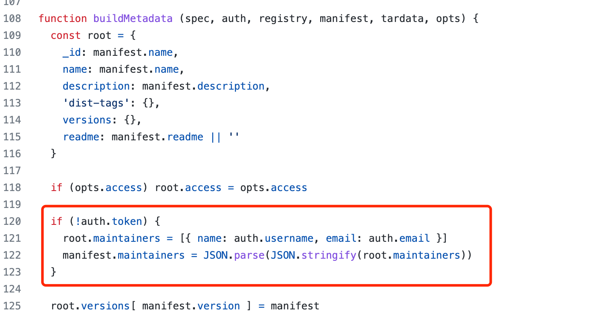

# npm8 publish error 问题分析

本文主要记录了 npm6 升级到 npm8 之后，执行 npm publish error 问题分析的过程。

## 1. 背景
node14 版本升级到 node16 版本之后，npm 也从 npm6 升级到了 npm8，此时会报如下错误：

## 2. 问题分析
首先确认 node16 的 npmrc 有没有配置错误，确认和 node14 的 npmrc 配置路径一样，所以可以确认 npmrc 路径没有问题。

再确认这个包是否能够正常发布。发现 node14 版本（对应 npm 6.14.11）可以正常部署，node16 版本（对应 npm 8.3.1）不能正常部署。

查看 cnpmjs 源码，搜索 maintainers error，发现如下逻辑 cnpmjs/controllers/registry/package/save.js：

所以基本可以确定和 npm6.14.11 和 npm8.3.1 传递到 cnpm 服务器的数据是不一样的。

### 2.1 抓包分析
切换到 node14，执行 npm publish 发布命令，通过命令 tcpdump -w node14_dump.txt 抓包结果如下：

切换到 node16，执行 npm publish 发布命令，通过命令 tcpdump -w node16_dump.txt 抓包结果如下：

对比发现，npm6.14.11 publish 时会带上 npmrc 里面的信息到 maintainer 中去，而 npm8.3.1 不会。所以 npm8.3.1 publish 时会报上述错误。

### 2.2 源码分析
对比 https://github.com/npm/cli/blob/v8.3.1/workspaces/libnpmpublish/lib/publish.js 和
https://github.com/npm/cli/blob/v6.14.11/node_modules/libnpmpublish/publish.js，可以发现 npm8.3.1 去除了添加 maintainer 的逻辑，这也印证了我们上的想法。

## 3. 解决方法
解决方法 1：这个方法也只能临时解决问题，不是最优解，在 pakcage.json 中，添加 maintainers: ["deploy"]，验证可以发布成功。

解决方法 2：https://github.com/cnpm/cnpmjs.org/commit/b7089d33d400f9fd4fc398479d4dac5aab26b633。
