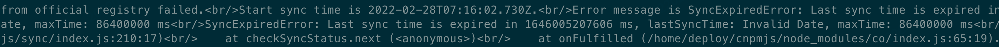

# 私有 cnpm 无法下载外网包的问题排查


本文主要记录了私有 cnpm 无法下载外网包的问题排查过程。同时给出对应的解决方案并对解决方案进行了验证。

<!-- more-->

## 1. 故障现象
用户报障外网 npm 包下载不到。


## 2. 故障排查
首先确认官方是否存在 @babel/plugin-transform-destructuring@7.17.3 包。
```shell
$ npm config set registry https://registry.npm.taobao.org

$ npm install @babel/plugin-transform-destructuring@7.17.3
```

如下图所示，发现官方确实存在该包。


再者，到公司 cnpm web 页面查找是否有 @babel/plugin-transform-destructuring@7.17.3 有包，查询发现没有该包。

查看日志 sync_error.log，发现如下报错：


postman 查看接口 https://registry.npm.taobao.org/-/all/since?stale=update_after&startkey=164347154587 返回，发现返回结果 404。


怀疑是官方 cnpm 否有改动，去 github 查看 issue。发现 [issue 1704](https://github.com/cnpm/cnpmjs.org/issues/1704) 和 [issue 1719](https://github.com/cnpm/cnpmjs.org/issues/1719) 和我们的情况类似。

根据 issue 描述情况，官方现在已经把 https://registry.npm.taobao.org/-/all/since?stale=update_after&startkey=164347154587 接口下掉了，所以需要合并代码 [1707](https://github.com/cnpm/cnpmjs.org/pull/1707) 才能修复。

## 3. 解决方案
将 config/index.js 中 https://registry.npm.taobao.org 替换为 https://registry.npmmirror.com。

由于，我们采用的是 2.19.4 tag 代码，将 [1707](https://github.com/cnpm/cnpmjs.org/pull/1707) 代码合并到 2.19.4 tag，进行验证。

验证过程中发现，总是报如下错误：


通过代码定位发现 sync/index.js 中 checkSyncStatus() 已经无法生效。因为官方不再以 lastSyncTime 来标记需要同步的包，而是换了 lastSeq 这个标记位。所以还需要注释掉两处 yield checkSyncStatus() 代码。

<font color=FF0099>**存量模块如何同步？**</font>通过 DB 查询库里面所有的非私有模块，编写一个脚本，循环调用如下接口即可：
```
http://私有 registry 域名/@vue/babel-preset-app/sync

method: put

其中 @vue/babel-preset-app 为模块名
```

## 4. 方案验证
本地搭建服务，这边不再赘述，参照[官网](https://github.com/cnpm/cnpmjs.org)即可。

启动服务验证进行验证。
```shell
$ node /home/deploy/cnpmjs/dispatch.js
```

官网上传包进行验证。参照 https://blog.csdn.net/taoerchun/article/details/82531549 上传官方包。

查看同步日志，发现上传成功。但是有一个疑惑。为什么我只上传了一个包，下图显示的是两个包同步 success？


下载验证:
```shell
$ npm install npm-xlxiao-test@latest --registry=http://127.0.0.1:7001
```


验证成功。

## 5. 源码剖析
由 4 中 "为什么我只上传了一个包，下图显示的是两个包同步 success？"的问题，便去查看了下源码。

定位到 sync/sync_exist.js 中 intersection 函数是这块的关键。
```js
var packages = intersection(existPackages, updatesPackages);
  debug('Total %d packages to sync, top 10: %j', packages.length, packages.slice(0, 10));
  if (!packages.length) {
    yield totalService.setLastExistSyncTime(lastSeq);
    debug('no packages need be sync, lastSeq: %s, changes: %s', lastSeq, changes.length);
    return {
      successes: [],
      fails: []
    };
  }


function intersection(arrOne, arrTwo) {
  arrOne = arrOne || [];
  arrTwo = arrTwo || [];
  var map = {};
  var results = [];
  arrOne.forEach(function (name) {
    map[name] = true;
  });
  arrTwo.forEach(function (name) {
    map[name] === true && results.push(name);
  });
  return results;
}
```

intersection 的主要作用就是如果一个包如果已经在库里面存在，并且在接口获取到的 updatesPackages 中，那么它就需要更新。

这次我只上传了 npm-xlxiao-test 一个包，但是日志显示更新了两次。所以怀疑官方接口返回了两个同样的包。调用接口 https://registry.npmmirror.com/_changes?since=27448638 验证猜测。发现确实会返回两个同样的包名，只是 changes 里面一个是 version，一个是 tag。

```json
{
    "results": [
        {
            "seq": 27448640,
            "type": "PACKAGE_VERSION_ADDED",
            "id": "@ticketmaster/allure-create-app",
            "changes": [
                {
                    "version": "4.0.11-alpha.15"
                }
            ]
        },
        {
            "seq": 27448642,
            "type": "PACKAGE_TAG_CHANGED",
            "id": "@ticketmaster/allure-create-app",
            "changes": [
                {
                    "tag": "latest"
                }
            ]
        }
    ]
}
```

那么日志显示同样的包同步两次成功，是否真的到官网去同步了两次呢？查看 sync/sync_exist.js 代码和 controllers/sync_module_worker.js 代码。

sync/sync_exist.js 
```js
  var worker = new SyncModuleWorker({
    username: 'admin',
    name: packages,
    concurrency: config.syncConcurrency,
    syncUpstreamFirst: false,
  });
  Status.init({need: packages.length}, worker);
  worker.start();
```

controllers/sync_module_worker.js
```js
SyncModuleWorker.prototype.start = function () {
  this.log('user: %s, sync %s worker start, %d concurrency, nodeps: %s, publish: %s',
    this.username, this.names[0], this.concurrency, this.noDep, this._publish);
  var that = this;
  co(function* () {
    // sync upstream
    if (that.syncUpstreamFirst) {
      try {
        yield that.syncUpstream(that.startName);
      } catch (err) {
        logger.error(err);
      }
    }

    if (that.type === 'user') {
      yield that.syncUser();
      return;
    }

    var arr = [];
    for (var i = 0; i < that.concurrency; i++) {
      arr.push(that.next(i));
    }
    yield arr;
  }).catch(function (err) {
    logger.error(err);
  });
};
```

<font color=FF0099>**关键逻辑还是在 that.next 里面。后面就没有再去追溯原因了。**</font>


## 6. 一些疑惑
修复过程中第一次设置 total 表 last_exist_sync_time 字段的值，取自 https://registry.npmmirror.com/ 接口 update_seq 的值。后续这个值被当做参数 lastSeq 传递给官方源，来获取需要变更的包。代码如下所示：


那么官方 lastSeq 的值的意义是什么？我怎么才能设置一个值获取到我之前变化的包呢？
