# 携程多架构镜像构建实践


## 1. 背景
目前公司 AWS 上部署使用的机器为 AMD 机器，成本比较高。整体的诉求是希望通过某种方式能够节约成本。通过调研发现 AWS 上 ARM 类型的机器在成本上比较有优势，并且能够比较快的的落地。它相对于 AMD 机器具有如下优势：
  - 价格比 AMD 便宜 10%
  - Nginx 性能提升 20%
  - Redis 性能提升 30% ~ 40%

现在大部分的应用部署已经容器化，所以部署容器到 ARM 类型的机器 ARM 架构镜像就必不可少。最简单的方式就是单独为 ARM 类型的镜像开辟一条新的流程。这些包括：基础组件镜像、应用基础镜像、应用镜像等 ARM 镜像的构建。这种方式会带来如下问题：
  - <font color=FF0099>**运维成本增加**</font>：除了本身原来私有云 AMD 机器镜像的构建流程，多维护一套镜像构建流程。
  - <font color=FF0099>**扩展性差**</font>：如果后期又需要添加新的架构构建，又得再次重复上述流程。

基于上述背景，我们需要寻找一种方案来完成镜像的多架构构建。

## 2. 方案调研
通过调研发现使用 buildx，我们无需对 Dockerfile 进行任何修改，就可以创建支持多种 CPU 架构的 Docker 镜像，然后将其推送到 Docker Hub。任何安装了 Docker 的系统都可以拉取到与它的 CPU 架构相对应的镜像。[<sup>1</sup>](#refer-anchor-1)

## 3. POC
为了能够验证这套流程可以正常运行，我们先手动在各阶段做了 POC。

### 3.1 centos 多架构镜像制作（[官方 hub](https://hub.docker.com/_/centos?tab=tags)）[<sup>2</sup>](#refer-anchor-2)
<font color=FF0099>**注意：下面的操作是在个人 MAC 上操作。**</font>

第一步：推送 centos:7.9.2009-amd64 镜像到私有 hub
- 拉取官方 amd64 版本镜像
    ```shell
    docker pull --platform amd64 centos:centos7.9.2009
    ```

- 查看当前镜像架构版本
    ```shell
    docker inspect centos:centos7.9.2009
    ```
    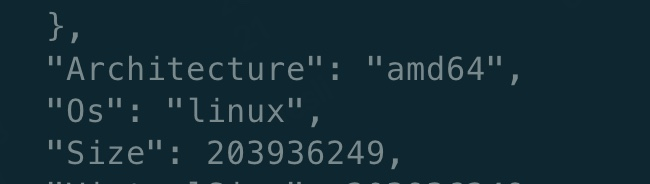

- 推送镜像
    ```shell
    docker tag centos:centos7.9.2009 hub.xlxiao.com/container/centos:7.9.2009-amd64

    docker push hub.xlxiao.com/container/centos:7.9.2009-amd64
    ```

第二步：推送 centos:7.9.2009-arm64 镜像到私有 hub
- 拉取官方 amd64 版本镜像
    ```shell
    docker pull --platform arm64 centos:centos7.9.2009
    ```

- 查看当前镜像架构版本
    ```shell
    docker inspect centos:centos7.9.2009
    ```
    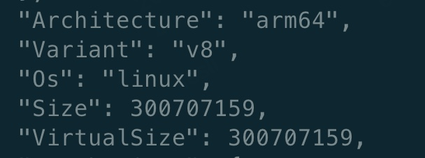

- 推送镜像
    ```shell
    docker tag centos:centos7.9.2009 hub.xlxiao.com/container/centos:7.9.2009-arm64

    docker push hub.xlxiao.com/container/centos:7.9.2009-arm64
    ```

第三步：制作多架构镜像 centos:7.9.2009
- 创建 manifest 列表
    ```shell
    docker manifest create hub.xlxiao.com/container/centos:7.9.2009 \
        hub.xlxiao.com/centos:7.9.2009-amd64 \
        hub.xlxiao.com/centos:7.9.2009-arm64
    ```

- 查看 manifest 列表
    ```shell
    docker manifest inspect hub.xlxiao.com/container/centos:7.9.2009 \
        hub.xlxiao.com/centos:7.9.2009-amd64 \
        hub.xlxiao.com/centos:7.9.2009-arm64
    ```
    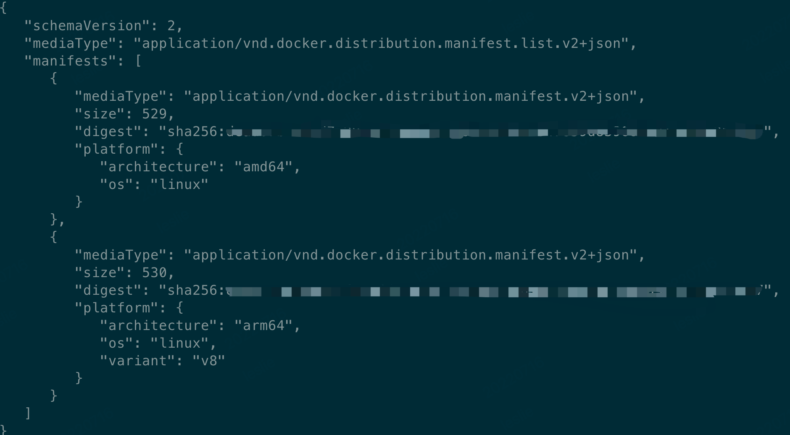

- 推送 manifest 列表
    ```shell
    docker manifest push hub.xlxiao.com/container/centos:7.9.2009
    ```

第四步：验证
登录 hub 查看：
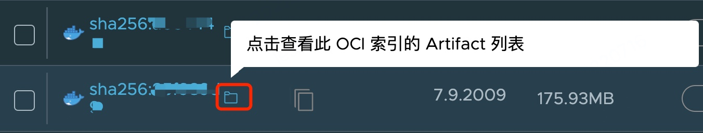

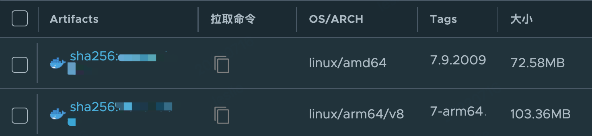

### 3.2 构建机器环境准备
前置条件：
- Docker >= 19.03: 自该 Docker 版本包含 buildx。
    ```shell
    docker -v 
    ```
    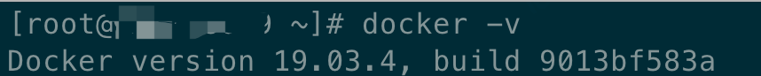

- Linux kernel >= 4.8: 自该Linux内核版本 binfmt_misc 支持 fix-binary (F) flag。fix_binary 标志允许内核在容器或 chroot 内使用 binfmt_misc 注册的二进制格式处理程序，即使该处理程序二进制文件不是该容器或 chroot 内可见的文件系统的一部分。
    ```shell
    cat /proc/version

    uname -a
    ```
    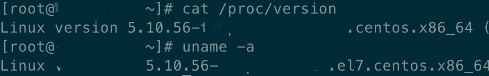

- binfmt_misc file system mounted: 需要挂载 binfmt_misc 文件系统，以便用户空间工具可以控制此内核功能，即注册和启用处理程序。
    ```shell
    docker run --privileged docker/binfmt:66f9012c56a8316f9244ffd7622d7c21c1f6f28d

    ll /proc/sys/fs/binfmt_misc/

    cat /proc/sys/fs/binfmt_misc/qemu-aarch64
    ```
    执行完后，我们验证下是否注册成功了。成功注册后，/proc/sys/fs/binfmt_misc 目录中会有多个qemu-前缀的文件。查看 /proc/sys/fs/binfmt_misc/qemu-aarch64 文件内容，可以看到 falgs 标志为 OCF，说明这个处理程序是通过。

    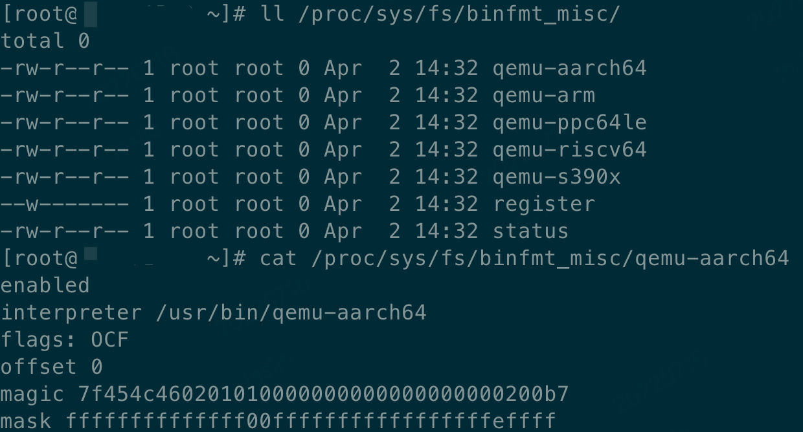

    注意：到目前位置，buildx支持 linux/amd64, linux/386, linux/arm/v7, linux/arm/v6, linux/arm64, linux/ppc64le, linux/s390x。所以 docker/binfmt 镜像仅注册了 arm、ppc64le 和 s390x 的处理程序。如果你需要构建、运行 RISC-V 平台的容器镜像，建议使用 multiarch/qemu-user-static 镜像镜像配置。
    ```shell
    docker run --rm --privileged multiarch/qemu-user-static --reset -p yes
    ```

    作用：qemu-user-static 是一个用于利用当前操作系统来运行其它架构的一个仿真器，这个 github 项目可以通过 x86 的机器编译出其它各个架构的 docker 镜像。

配置 Buildx：

buildx 从 19.03 开始与 Docker CE 捆绑发布，但是需要我们在 Docker CLI 上启用实验性功能开开启。可以通过两种方式启用它：
1. 将 "experimental": "enabled” 添加到 Docker CLI 的配置文件 ~/.docker/config.json。
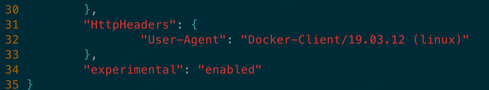

2. 另外一种方法时设置环境变量 DOCKER_CLI_EXPERIMENTAL=enabled。

给 /etc/docker/daemon.json 添加属性：experimental，并重启 docker。否则执行命令会报如下错误：
```shell
docker pull --platform arm64 hub.xlxiao.com/container/centos:7.9.2009
```


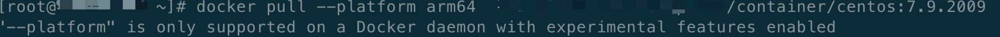

从 https://github.com/docker/buildx/releases 下载二进制发行版，并将其复制到 ~/.docker/cli-plugins 文件夹中，重命名为 docker-buildx，然后更改执行权限：
```shell
chmod +x ~/.docker/cli-plugins/docker-buildx
```

验证 buildx 是否可以使用：
```shell
docker buildx version
```
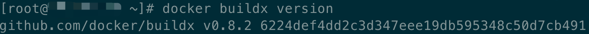

### 3.3 应用镜像构建
准备 Dockerfile 内容如下：
```
FROM hub.xlxiao.com/container/centos:7.9.2009

RUN echo hello
```

运行 buildx
```shell
docker buildx build --platform linux/amd64,linux/arm64 -t test .
```

居然报错 <font color=FF0099>**error: auto-push is currently not implemented for docker driver, please create a new builder instance**</font> 了！别担心，这是因为 Docker 默认的 builder 是不支持多平台构建的。我们可以通过 docker buildx ls 查看当前节点上的 builder 有哪些。

```shell
docker buildx ls

NAME/NODE DRIVER/ENDPOINT STATUS  PLATFORMS
default * docker
  default default         running linux/amd64, linux/386
```

为了使用多平台构建功能，我们需要新建一个 builder，并设置当前 builder 为新建的.

```shell
# 新建同时切换 builder 
docker buildx create --use --name mybuilder

# 只新建，然后再切换 builder
docker buildx create --name mybuilder
docker buildx use mybuilder
```

再次运行 buildx，此次可以运行成功
```shell
docker buildx build --platform linux/amd64,linux/arm64 -t test .
```

## 4. 产品落地
### 4.1 Centos 多架构基础镜像
这里可以参照 3.1 内容。

### 4.2 应用多架构基础镜像
统一 amd 架构和 arm 架构 yum 依赖包版本，确保两套架构的 yum 源都有相应的依赖包版本。

构建的 arm 类型镜像太大。Dockerfile 里面的 yum update -y --exclude=centos-* 语句导致 arm 类型镜像大小暴增到 9G。yum udpate 主要包括三块内容：内核、操作系统和其他软件。由此判断出，这一层级过大，是更新内核导致的。所以把原有 yum update -y --exclude=centos-* 改为 yum update -y --exclude=centos-* --exclude=kernel-*。

pip 包没有多架构版本。采用源码方式安装。

libsysconfcpus jdk tomcat 多架构版本如何控制。
  - 关于 libsysconfcpus 参考文档如下：
    - https://www.cnblogs.com/fengjian2016/p/9916180.html
    - https://github.com/obmarg/libsysconfcpus

  - 控制方法：分别在 amd 和 arm 机器上通过这些包的源码构建出它们的 rpm 包，然后把它们上传到相对应架构的 yum 源即可。

至此，应用多架构基础镜像问题基本解决。

### 4.3 CI 集成多架构构建
目前我们采用的是 GitlabCI docker in docker 的方式来进行镜像构建。初始我们使用的是 17.09.0，所以需要升级到 19.3 以上，可参考文章 https://about.gitlab.com/blog/2019/07/31/docker-in-docker-with-docker-19-dot-03/。

CI 集成中的一些坑及解决办法：
- failed to fetch oauth token。主要原因 Docker Client 端证书安装。
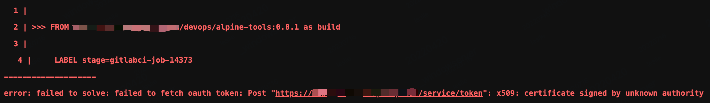

- failed to request 509 error。主要原因 moby/buildkit:buildx-stable-1 证书没有安装。
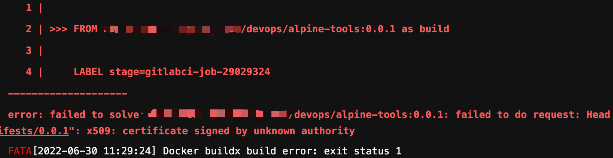

  - 如何验证证书有没有安装：grep 证书部分值 /etc/ssl/certs/*

- buildx 缓存清理调研，目前无法指定某个镜像清除缓存，只能通过 buildx prune 清理，但是这会影响构建速度

  - 默认缓存地址：/var/lib/docker/volumes/buildx_buildkit_mybuilder0_state/_data/runc-overlayfs/content/blobs/sha256

  - 尝试使用 --storage 参数保留一定大小的缓存

## 5. 参考文献
<div id="refer-anchor-1"></div>

[1] [使用 buildx 构建多种系统架构支持的 Docker 镜像](http://dockeradv.baoshu.red/buildx/multi-arch-images.html).

<div id="refer-anchor-2"></div>

[2] [构建多种系统架构支持的 Docker 镜像](https://yeasy.gitbook.io/docker_practice/image/manifest).

<div id="refer-anchor-3"></div>

[3] [多平台容器镜像构建就看这一篇](https://www.cnblogs.com/tencent-cloud-native/p/14190655.html).
